### Actividad: Ejecutar pruebas con pytest

**Paso 1: Instalando pytest y pytest-cov**
Ejecuté en mi terminal el comando `pip install pytest pytest-cov` para instalar el framework de pruebas y la herramienta de cobertura de código en Python.

**Paso 2: Escribiendo y ejecutando pruebas con pytest**
Ejecuté el comando `pytest -v` para correr las pruebas con salida detallada, pero no se detectaron pruebas en ese momento.
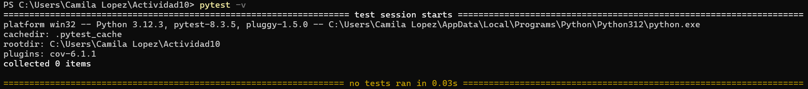

**Paso 3: Añadiendo cobertura de pruebas con pytest-cov**

Para ejecutar las pruebas y obtener un informe de cobertura, se utiliza el comando `pytest --cov=src`, el cual muestra el porcentaje del código cubierto por las pruebas dentro del paquete `src`.

**Ejemplo**
Este ejemplo adopta la siguiente estructura de carpetas y archivos:
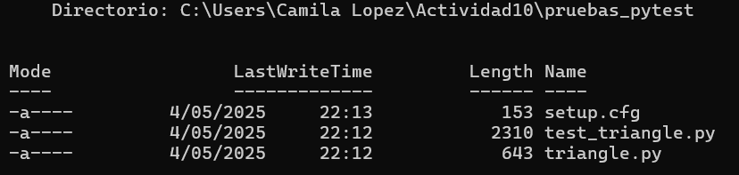

Se ejecutó el comando `pytest --cov=pruebas_pytest` y se obtuvo un informe que muestra la cobertura total del paquete, confirmando que todos los tests en `test_triangle.py` cubren el 100% del archivo `triangle.py`.
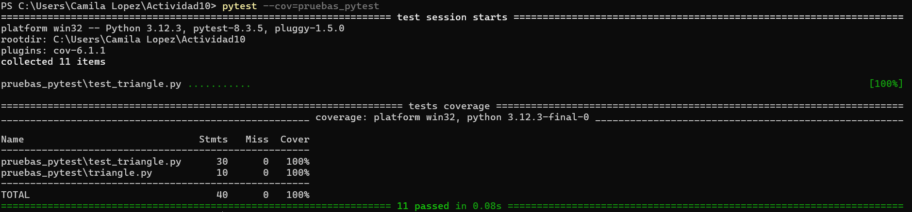

Para generar un informe de cobertura en formato HTML y visualizarlo gráficamente en el navegador, se ejecutó el comando `pytest --cov=pruebas_pytest --cov-report=html`, lo que generó una carpeta `htmlcov` con el reporte completo.

El informe de cobertura HTML muestra que el 100% del código ha sido cubierto por pruebas, incluyendo los archivos `test_triangle.py`  y `triangle.py`.
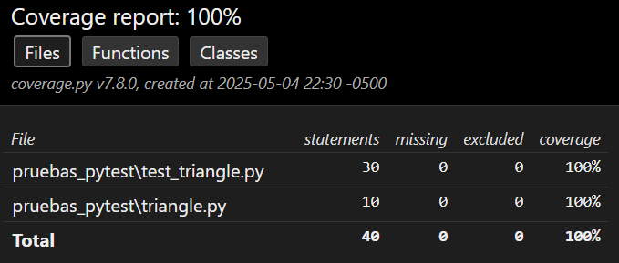

El reporte muestra que todas las funciones de prueba en `TestAreaOfTriangle` fueron ejecutadas y cubren el 100% del código, validando correctamente diferentes tipos de entradas y la función principal `area_of_a_triangle`.
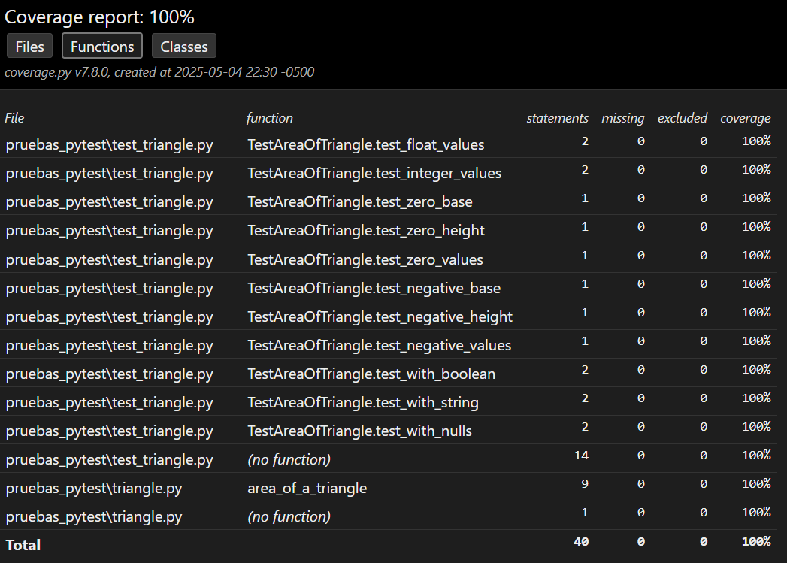

El análisis por clases indica que tanto la clase de pruebas como el código sin clases en `triangle.py` lograron cobertura completa, asegurando que todo el código fue ejecutado durante las pruebas.
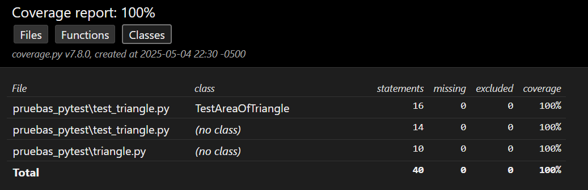  

Para medir la cobertura de un módulo específico como `triangle.py`, ejecutamos el comando `pytest -v --cov=triangle`, el cual genera un informe detallado indicando qué porcentaje del código de ese módulo ha sido cubierto por las pruebas.
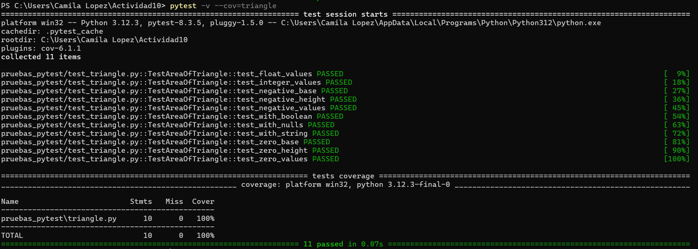

Para obtener un informe más detallado que indique las líneas de código no cubiertas por las pruebas, se ejecutó el comando `pytest --cov=triangle --cov-report=term-missing`, el cual muestra directamente en la terminal qué partes del código requieren más pruebas para alcanzar una cobertura completa.
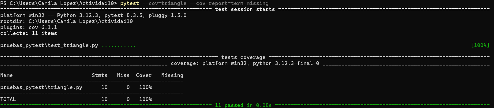

Además, para generar un informe en HTML con el mismo detalle sobre cobertura de código, se ejecutó el comando `pytest --cov=triangle --cov-report=term-missing --cov-report=html`, lo que permitió visualizar tanto en consola las líneas faltantes, como un reporte interactivo en HTML con la cobertura completa del módulo.

En el reporte interactivo en HTML, se visualiza que el archivo `triangle.py` contiene 10 líneas ejecutables y todas están cubiertas por pruebas, logrando un 100% de cobertura.
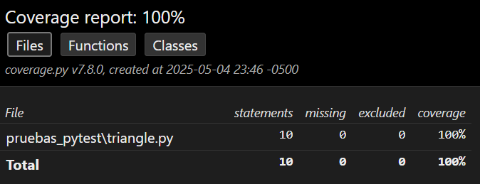

Se visualiza que la función `area_of_a_triangle` tiene 9 líneas cubiertas y una línea fuera de función también está cubierta, confirmando cobertura total.
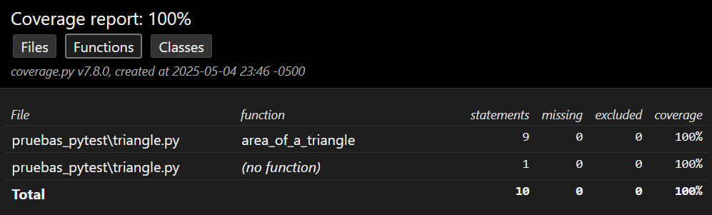

Indica que no se utilizó ninguna clase en el archivo, pero aun así todas las líneas de código están cubiertas, manteniendo el 100% de cobertura.
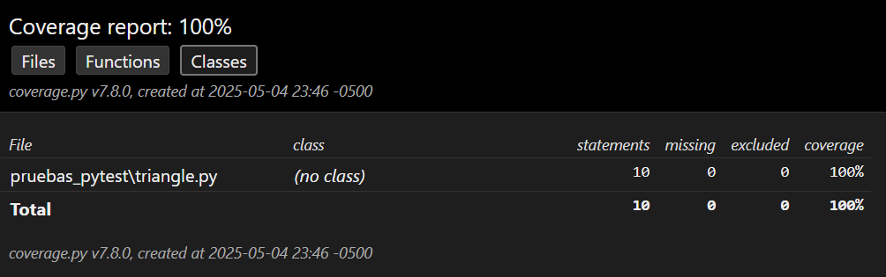

**Paso 5: Automatizando la configuración de pytest**
En lugar de escribir todos los parámetros de configuración cada vez que ejecutes pytest, puedes guardarlos en un archivo pytest.ini o setup.cfg. 

**setup.cfg**
`setup.cfg` es un archivo central de configuración que permite definir parámetros para distintas herramientas del proyecto, como `pytest` y `coverage`, mediante secciones específicas.

La configuración definida en `setup.cfg` se estructura de la siguiente manera:
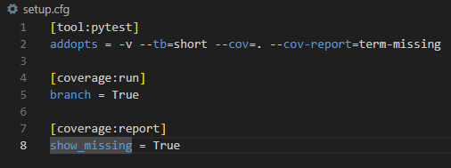
- **[tool:pytest]**  
    Esta sección configura Pytest con opciones adicionales: `-v` para modo detallado, `--tb=short` para rastros de error breves, y opciones de cobertura con `--cov=.` y `--cov-report=term-missing`.
- **[coverage:run]**  
    Habilita el seguimiento de cobertura de ramas (`branch = True`), lo cual es útil para saber si todas las rutas condicionales del código han sido evaluadas.
- **[coverage:report]**  
    Especifica que el informe de cobertura debe mostrar qué líneas no se ejecutaron (`show_missing = True`), lo que ayuda a identificar partes del código no probadas.

**pytest.ini**
`pytest.ini` es un archivo de configuración exclusivo para pytest, utilizado para definir opciones específicas de ejecución y mantener organizada la configuración de pruebas dentro de un proyecto.

La configuración definida en `pytest.ini` se estructura de la siguiente manera:
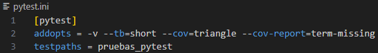

**Paso 6: Ejecutando pruebas con la configuración automatizada**

Se ejecutó `pytest` sin parámetros adicionales, aprovechando la configuración previamente definida en el archivo `setup.cfg` o `pytest.ini` para automatizar la ejecución de pruebas.
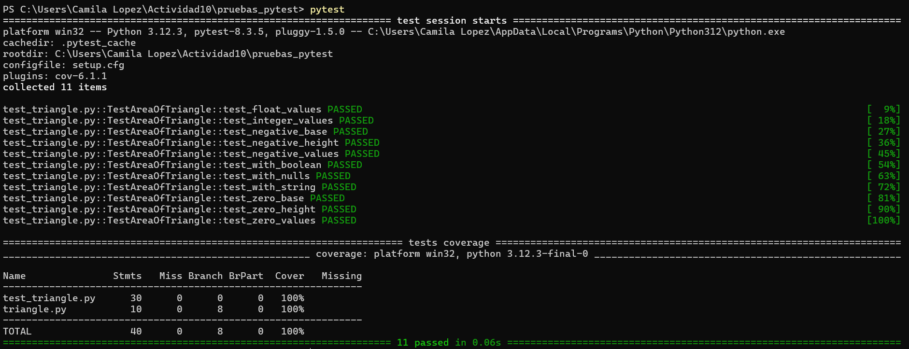

