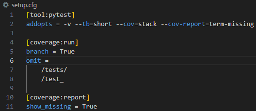

### Actividad 11: Escribir aserciones en pruebas con pytest

**Paso 1: Instalación de pytest y pytest-cov**
En esta actividad se practica el uso de `pytest` para ejecutar pruebas unitarias, identificar fallos mediante aserciones y generar informes de cobertura con `pytest-cov`.

Primero, instalamos `pytest` y `pytest-cov` ejecutando en la terminal:

**Paso 2: Archivos de prueba**

La estructura consta de dos archivos para esta actividad: `stack.py` y `test_stack.py`.

- `stack.py`: Contiene la implementación de una pila (stack) que queremos probar.
- `test_stack.py`: Contiene el esqueleto de las pruebas para los métodos `push()`, `pop()`, `peek()`, y `is_empty()`.

Antes de escribir los casos de prueba, revisemos los métodos de la clase `Stack`:

Descripción de funciones:

- `push()`: Añade un elemento a la parte superior de la pila.
- `pop()`: Elimina y devuelve el elemento en la parte superior de la pila.
- `peek()`: Devuelve el valor del elemento en la parte superior de la pila sin eliminarlo.
- `is_empty()`: Devuelve True si la pila está vacía y False si no lo está.

Se verificó la ejecución de las pruebas usando `pytest -v`, confirmando que todos los casos (`is_empty`, `peek`, `pop` y `push`) pasaron exitosamente.

Se verificó usando `pytest -x`, que permite detener la ejecución al primer fallo, útil para identificar rápidamente errores sin ejecutar todos los tests.

Por defecto, pytest ejecuta las pruebas en el orden en que están definidas en los archivos. Para usar un orden aleatorio, se puede emplear el plugin `pytest-randomly`, útil para detectar dependencias entre pruebas.

Instalamos el plugin con `pip install pytest-random-order`

Luego ejecutamos las pruebas con `pytest --random-order` para validarlas en un orden aleatorio, verificando así su independencia.

**Paso 3: Escribiendo aserciones para el método `is_empty()`**

El método `test_is_empty` verifica que una pila nueva esté vacía y que deje de estarlo después de insertar un elemento.

El método `test_pop` comprueba que los elementos se extraigan en orden correcto (LIFO) y que la pila quede vacía después de eliminar todos los elementos.

**Paso 4: Ejecuta pytest para verificar `is_empty()`**

Se ejecutó `pytest -v` para verificar que la prueba del método `is_empty()` pase correctamente, y como muestra la salida, todas las pruebas fueron exitosas.

**Paso 5: Escribiendo aserciones para el método `peek()`**

El test `test_peek()` verifica que `peek()` devuelva correctamente el último elemento agregado sin eliminarlo de la pila.  

El test `test_peek_with_setup()` confirma lo mismo, pero usando una pila preconfigurada con `setUp`.

Se ejecutó `pytest -v` para verificar que la prueba del método `peek()` pase correctamente, y como muestra la salida, todas las pruebas fueron exitosas.

**Paso 6: Escribiendo aserciones para el `método pop()`**

El test `test_pop()` verifica que el método `pop()` elimine y devuelva correctamente el último elemento agregado y que el nuevo tope de la pila sea el siguiente valor.

El test `test_pop_with_setup()` usa `self.stack` y realiza una prueba más completa: agrega dos elementos, comprueba que `pop()` devuelve el último, que `peek()` muestra el anterior, elimina ese también, y finalmente valida que la pila quede vacía.

Se ejecutó `pytest -v` para verificar que la prueba del método `pop()` pase correctamente, y como muestra la salida, todas las pruebas fueron exitosas.

**Paso 7: Escribiendo aserciones para el `método push()`**

El test `test_push()` comprueba que al insertar elementos con `push()`, el último añadido sea el que se encuentre en la parte superior de la pila. 

El test `test_push_with_setup()` valida lo mismo pero usando `self.stack`, asegurando que `peek()` siempre muestre el último valor insertado.
`

**Paso 8: Ejecuta pytest para verificar todas las pruebas**
Se ejecutó `pytest -v` para verificar que la prueba del método `push()` pase correctamente, y como muestra la salida, todas las pruebas fueron exitosas.

**Paso 9: Agregando cobertura de pruebas con pytest-cov**

Se ejecutó el comando `pytest --cov=stack --cov-report term-missing` para generar un informe de cobertura, el cual muestra el porcentaje de líneas de código de `stack.py` que están siendo cubiertas por las pruebas, así como las líneas que aún no han sido probadas.

**setup.cfg**
Este es un archivo de configuración para pytest y coverage, que personaliza cómo se ejecutan las pruebas y cómo se recopila el informe de cobertura de código. 

`[tool:pytest]` Esto indica que las configuraciones que siguen son para la herramienta pytest, el marco de pruebas en Python.

- `-v`: Muestra las pruebas con más detalle durante la ejecución.
- `--tb=short`: Acorta el rastro de errores para hacerlo más legible.
- `--cov=stack`: Calcula la cobertura del archivo o módulo `stack.py`.
- `--cov-report=term-missing`: Muestra en terminal las líneas de código no cubiertas por las pruebas.

`[coverage:run]` Este bloque contiene configuraciones específicas para el comando coverage run, que ejecuta las pruebas y recopila datos de cobertura.

- `branch = True`: Activa la cobertura de ramas, evaluando tanto la condición verdadera como falsa en estructuras como `if`.
- `omit = */tests/*`: Excluye todos los archivos ubicados dentro de carpetas llamadas `tests` del informe de cobertura.
- `omit = */test_*`: Excluye archivos cuyo nombre comienza con `test_`, como los de pruebas unitarias, para enfocarse solo en el código funcional.

`[coverage:report]`Este bloque define cómo se debe generar el informe de cobertura de código después de ejecutar las pruebas.

 - `show_missing = True`: Muestra en el informe las líneas de código que no fueron cubiertas por las pruebas, facilitando la identificación de partes no testeadas.
