### Actividad 12: Revisión de fixtures en pruebas

### **Paso 1: Inicializar la base de datos**

En el presente proyecto, se configura un fixture de pytest con alcance `module` para conectar y cerrar la base de datos una vez por archivo de pruebas, optimizando así la inicialización de recursos al ejecutar múltiples tests.

#### Solución

El método `setup_database()` es un fixture de pytest con alcance de módulo (`scope="module"`) que se ejecuta automáticamente antes y después de todas las pruebas del módulo. Dentro de un contexto de aplicación (`app_context()`), crea todas las tablas en la base de datos antes de las pruebas (`db.create_all()`), permite la ejecución de pruebas mediante `yield`, y al finalizar, elimina la sesión activa (`db.session.remove()`) y borra las tablas creadas (`db.drop_all()`), garantizando un entorno limpio para cada módulo de pruebas.

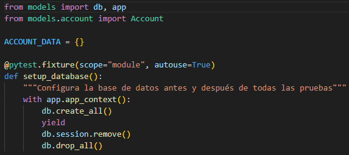

#### Ejecutar las pruebas
Se ejecutó `pytest` correctamente, pero no se encontraron pruebas disponibles para ejecutar.
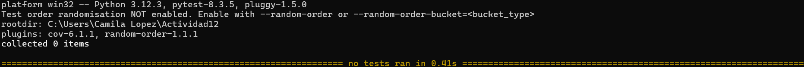

### **Paso 2: Cargar datos de prueba**

En este paso del proyecto, se proporciona el contexto para cargar datos de prueba desde un archivo `account_data.json`, ubicado en `tests/fixtures`. Este archivo contiene información necesaria para ejecutar pruebas automatizadas que requieren datos preexistentes, como cuentas o usuarios. 

Usando Python y el módulo `json`, se cargan esos datos en una variable global llamada `ACCOUNT_DATA`, la cual estará disponible para todas las pruebas de la clase.
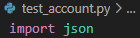

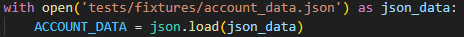

#### Solución

El método `setup_class` dentro de la clase `TestAccountModel` se encarga de cargar una sola vez los datos de prueba desde un archivo JSON (`account_data.json`) antes de ejecutar cualquier prueba de la clase. Lo hace utilizando la palabra clave `global` para asignar los datos cargados a la variable `ACCOUNT_DATA`, permitiendo que estén disponibles globalmente durante las pruebas. Además, imprime los datos cargados para confirmar su correcta lectura. Este método se ejecuta automáticamente una vez por clase gracias al decorador `@classmethod`, facilitando la preparación del entorno de pruebas sin duplicar código.

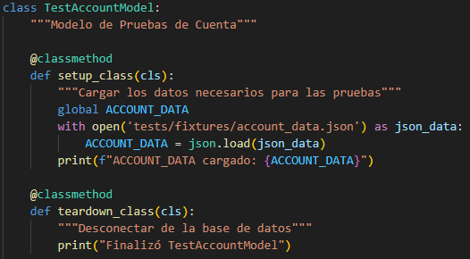

### **Paso 3: Escribir un caso de prueba para crear una cuenta**

En este paso del proyecto, ya se han configurado los fixtures y cargado los datos necesarios para las pruebas. El objetivo ahora es escribir un caso de prueba que verifique si se puede crear correctamente una cuenta en la base de datos utilizando esos datos cargados previamente en `ACCOUNT_DATA`.

#### Solución

El método `test_create_an_account` dentro de la clase `TestAccountModel` toma el primer conjunto de datos de prueba (`ACCOUNT_DATA[0]`) y lo usa para crear una instancia de `Account` dentro de un contexto de aplicación. Luego, llama al método `create()` para guardar la cuenta en la base de datos y finalmente verifica, con `assert`, que efectivamente se haya creado una única cuenta consultando `Account.all()`.

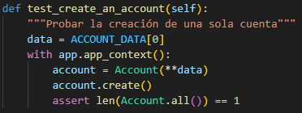

#### Ejecutar las pruebas
Se ejecutó correctamente `pytest`, lo que indica que las pruebas definidas hasta este punto están funcionando como se espera.
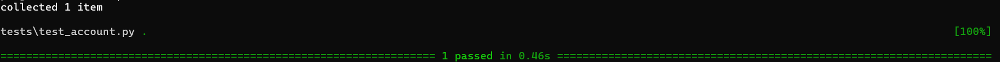

### **Paso 4: Escribir un caso de prueba para crear todas las cuentas**

En este paso del proyecto, después de comprobar que se puede crear correctamente una sola cuenta, se busca validar que se pueden crear múltiples cuentas utilizando todos los datos de prueba almacenados en el diccionario `ACCOUNT_DATA`. Esta prueba asegura que el sistema es capaz de manejar múltiples inserciones y que los datos se registran correctamente en la base de datos.

#### Solución
El método `test_create_all_accounts` recorre cada conjunto de datos dentro de `ACCOUNT_DATA`, crea una cuenta usando esos datos, la guarda en la base de datos con `create()`, y finalmente verifica que el número total de cuentas almacenadas con `Account.all()` coincide con la cantidad de entradas en `ACCOUNT_DATA`.

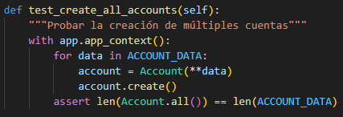

#### Ejecutar las pruebas
Se ejecutó correctamente `pytest`, lo que indica que las pruebas definidas hasta este punto están funcionando como se espera.
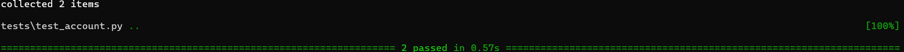

### **Paso 5: Limpiar las tablas antes y después de cada prueba**

En el contexto del proyecto, este paso se enfoca en mantener la integridad y confiabilidad de las pruebas al limpiar la base de datos antes y después de cada prueba. Esto es crucial para evitar que los datos residuales de una prueba interfieran con otras, lo que podría generar resultados falsos o inconsistentes.

- Para eliminar los datos de la tabla antes de cada prueba:
	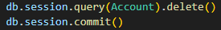

- Para eliminar la sesión después de cada prueba:
	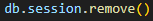

#### Solución

Los métodos `setup_method` y `teardown_method` dentro de la clase `TestAccountModel` implementan esta funcionalidad. El primero elimina todos los registros de la tabla `Account` y confirma la transacción antes de cada prueba, mientras que el segundo limpia la sesión de la base de datos una vez que la prueba ha finalizado, garantizando un entorno limpio y aislado para cada ejecución de prueba.
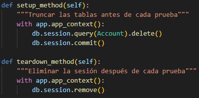

#### Ejecutar las pruebas

Se ejecutó correctamente `pytest`, lo que indica que las pruebas definidas hasta este punto están funcionando como se espera.
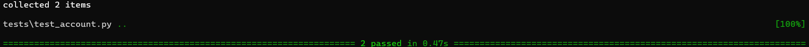

Recordar:
- El método `setup_class` se ejecuta una vez antes de todas las pruebas de la clase.
- El método `teardown_class` se ejecuta una vez después de todas las pruebas de la clase.
- El método `setup_method` se ejecuta antes de cada método de prueba.
- El método `teardown_method` se ejecuta después de cada método de prueba.

