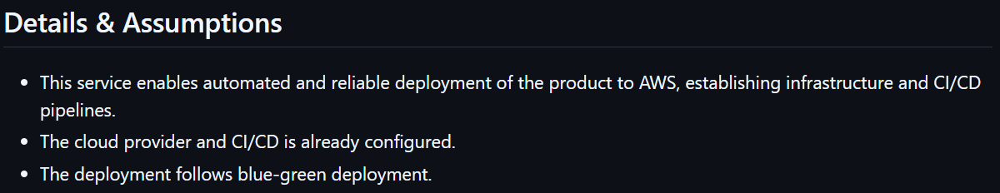

### **Actividad: Gestión ágil de proyectos con GitHub Projects, configuración de Kanban Board y creación de historias de usuario**

#### Parte 1

En este ejercicio, configuramos un Kanban board usando GitHub Projects para el repositorio del curso.

Primero creamos un proyecto llamado devops

Después de realizar cambios, tenemos 8 columnas en nuestro KanbanBoard

#### Parte 2

En este ejercicio, creamos una issue template en GitHub que nos ayudó a escribir historias de usuario bien formateadas en el Kanban board.

##### Crear una issue template en GitHub

En este ejercicio, creamos una issue template para las historias de usuario en GitHub.

####  Parte 3

En este ejercicio creamos historias de usuario basadas en los requisitos dados. 

- Deploy service to the cloud  

- Need the ability to remove a counter  

- Need the ability to update a counter to a new value  

#### Parte 4

En este ejercicio, seguimos los pasos para llevar a cabo una reunión de refinamiento del backlog. 

##### Hacer que las historias estén listas para el sprint

En esta parte, agregamos más detalles a las historias en el **Product Backlog** que c podrían entrar en el próximo sprint. 

Editamos los **Details** y **Assumptions** para que los desarrolladores sepan lo que sabemos. 

   - Deploy service to the cloud
   
   - Counters can be reset
   
   - Need ability to update a counter to a new value
   

##### Crear nuevas labels en GitHub

En este ejercicio, creamos una nueva label en GitHub llamada **technical debt** para marcar aquellas historias que no aportan valor visible al cliente pero deben completarse para continuar con el desarrollo.

##### Añadir labels a las historias

En este ejercicio, añadimos labels a las historias en el **Product Backlog** para hacerlas aún más listas para el sprint. 

### Ejercicios

##### Ejercicio 1: Crear un Epic y vincular historias de usuario

Creamos un nuevo Epic en el Kanban board llamado "Gestión de Contadores".

Vinculamos las historias de usuario existentes, como "Need a service that has a counter", "Must allow multiple counters", y "Counters can be reset" a este Epic y añadimos una nueva historia de usuario bajo este Epic que abarca una funcionalidad adicional 

##### Ejercicio 2: Uso avanzado de etiquetas (labels) para priorización y estado

Creamos nuevas etiquetas como **high priority**, **medium priority**, y **low priority**.

Luego, asignamos etiquetas a las historias de usuario que indiquen su prioridad

##### Ejercicio 3: Automatización de Kanban board con GitHub Actions

Creamos un archivo de configuración de GitHub Actions en la carpeta `.github/workflows` que defina estas reglas de automatización.

Las historias de usuario se mueven automáticamente en el Kanban board según las reglas definidas.

##### Ejercicio 4: Seguimiento de tiempo y esfuerzo usando GitHub Projects

Usamos el seguimiento de tiempo y esfuerzo para las historias de usuario en GitHub Projects.

Añadimos un campo personalizado Time Todo en el Kanban board para registrar el esfuerzo estimado de cada historia de usuario (en horas).

