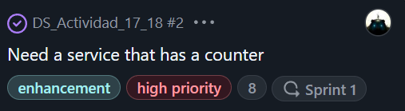
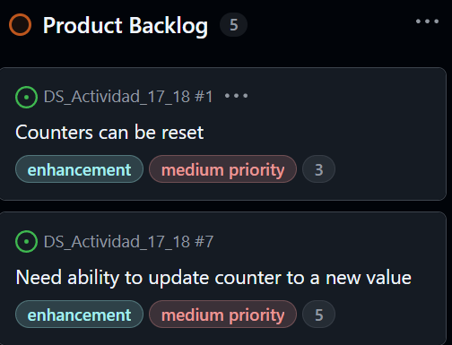
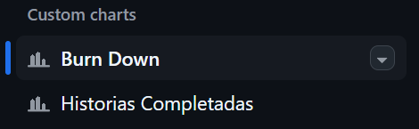
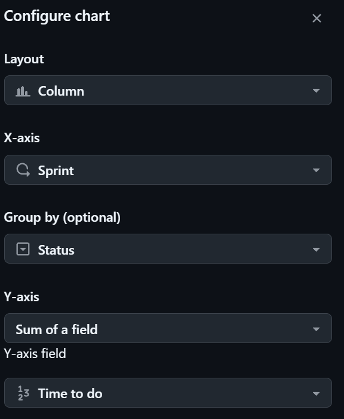
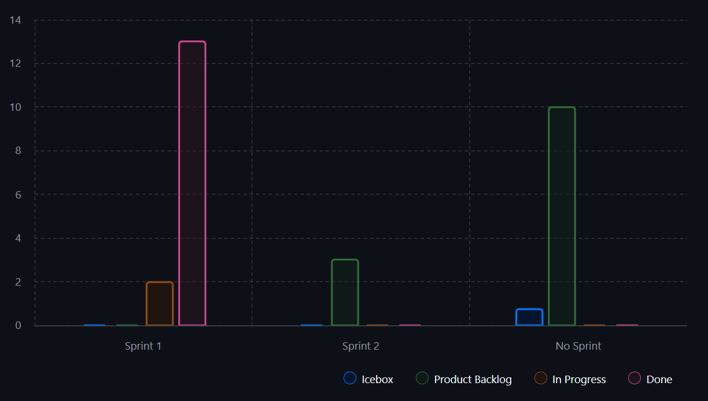
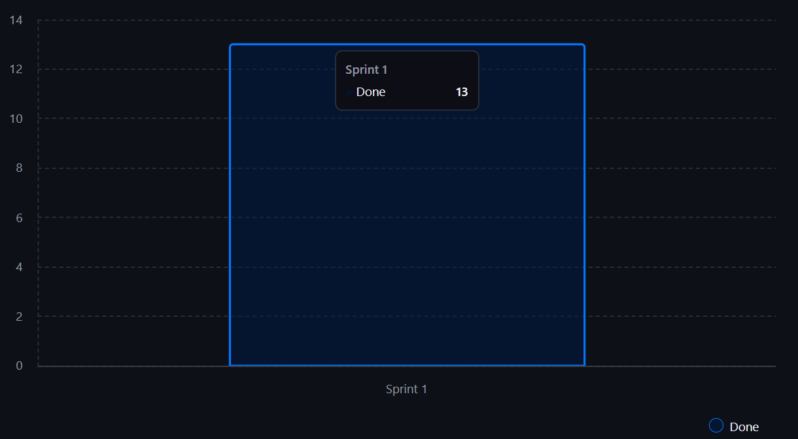
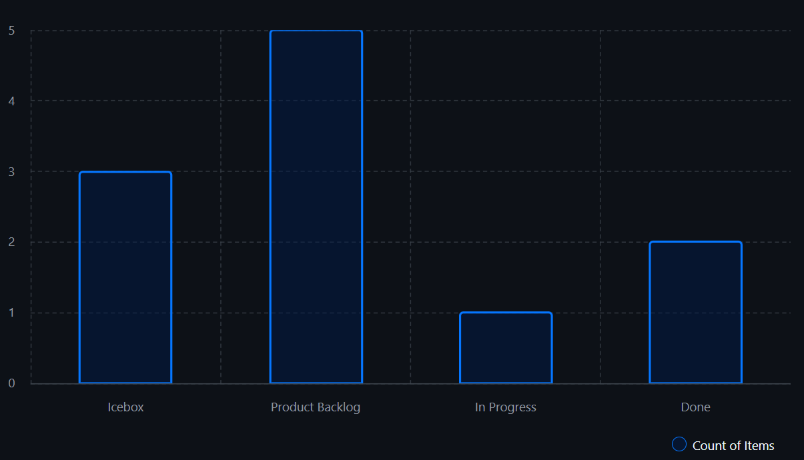
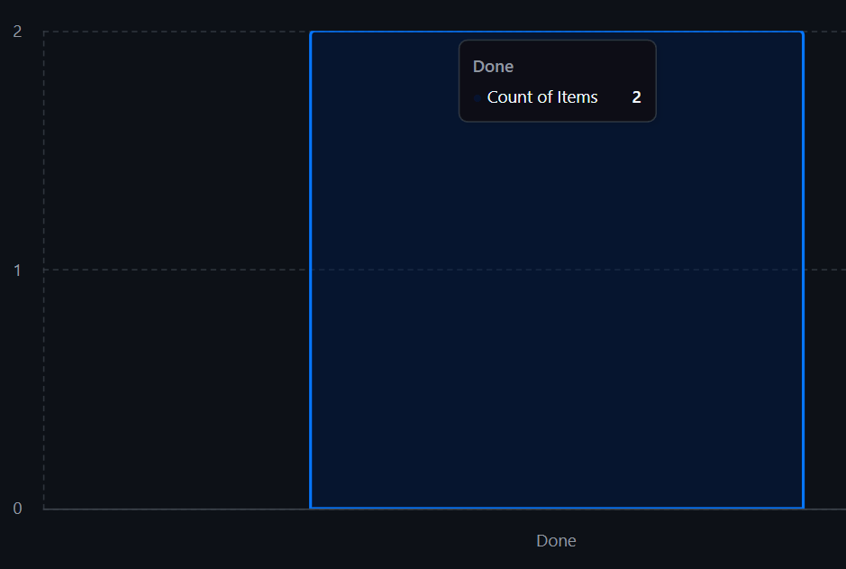
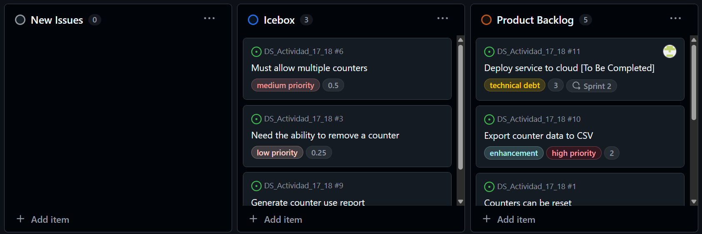
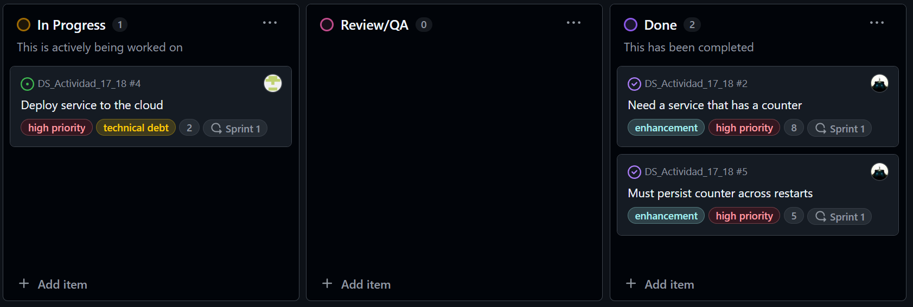

### **Actividad**: Gestión ágil de sprints con GitHub, planificación, ejecución y cierre de Sprints

#### Parte 1

En este ejercicio, creamos un plan de sprint a partir de tu product backlog. 

#### Crear un Sprint plan

Seleccionamos la historia superior **Need a service that has a counter** del Product Backlog y establecemos el **Estimate** en 8. También asignamos la historia al Sprint1.

Añadimos las siguientes estimaciones a las historias en el Product Backlog.

   - Counters can be reset -> 3  
   - Need ability to update a counter to new value -> 5  
   

####  Parte 3

En este ejercicio, configuraramos un burndown chart para el sprint plan usando GitHub. 

#### 1: Configurar tu Burndown Chart

Configutamos burndown chart para mostrar el estado de las historias en la columna Done.

Configuramos el gráfico de burdown chart

Gráfico por sprints

Gráfico en el sprint específico Sprint1

También podemos visualizar el número de historias de usuario por columna de kanban.

Luego podemos visualizar las historias que ya han sido completadas

#### Parte 3

#### Ejercicio: Gestionar el trabajo incompleto

En este ejercicio, gestionamos las historias no terminadas en el sprint. Estas son historias que el equipo ha comenzado, pero no ha completado. Ajustamos la estimación para contabilizar los story points gastados, de modo que se refleje en la velocidad del equipo, y crear una nueva historia para finalizar el trabajo en el próximo sprint.

Estado final del KanbanBoard

