### Actividad: Escribiendo infraestructura como código en un entorno local con Terraform

#### Fase 0: Preparación 
Revisamos el proyecto de la actividad

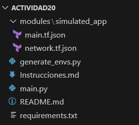

* La carpeta `modules/simulated_app/` contiene los archivos `main.tf.json` y `network.tf.json`, que son archivos de configuración de Terraform en formato JSON.

* El archivo `generate_envs.py` genera entornos locales a partir de los archivos `main.tf.json` y `network.tf.json`

Verificamos que podemos ejecutar:

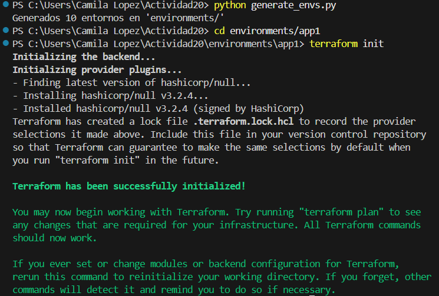


####  Fase 1: Expresando el cambio de infraestructura

En `modules/simulated_app/network.tf.json` modificamos el `default` de `"network"` a `"lab-net"`.

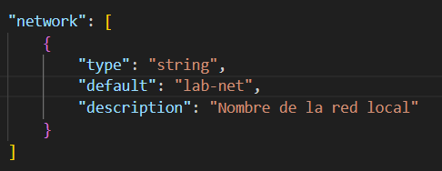

Luego, regeneramos `environments/app1` con `python generate_envs.py`. Notamos que se actualizó el directorio `environments/app1/` y sus archivos

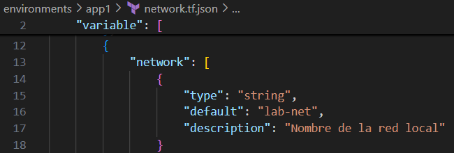

Cuando ejecutamos `terraform plan` observamos que detecta un cambio en el trigger del recurso `null_resource`.

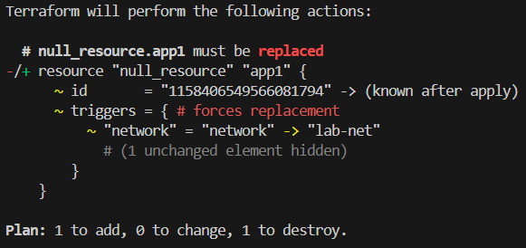

* **Pregunta**

  * ¿Cómo interpreta Terraform el cambio de variable? :
  Terraform compara el valor modificado de la variable con el valor registrado en `terraform.tfstate`. Si algún recurso utiliza esta variable, entonces se debe aplicar el cambio. Por otro lado, si dicha variable no se usa en algún recurso entonces no se detectan cambios. 
  * ¿Qué diferencia hay entre modificar el JSON vs. parchear directamente el recurso? :
  Cuando modificamos algun archivo json, estamos modificando el estado deseado que posteriormente puede aplicar dichas modificaciones y generar un nuevo estado actual, mientras que cuando parcheamos directamente el recurso estamos modificando el estado actual sin actualizar la configuracion deseada en json.
  * ¿Por qué Terraform no recrea todo el recurso, sino que aplica el cambio "in-place"? :
  Terraform solo destruye y crea un recurso cuando se modifica alguna variable que se encuentra dentro de triggers
  * ¿Qué pasa si editas directamente `main.tf.json` en lugar de la plantilla de variables? :
  Terraform reconoce el cambio en el recurso porque lo definimos de manera directa en el recurso, el cambio se aplica con terraform apply

#### Procedimiento

En `environments/app1/network.tf.json`, el `default` de la variable network originalmente esta en `"net1"` 

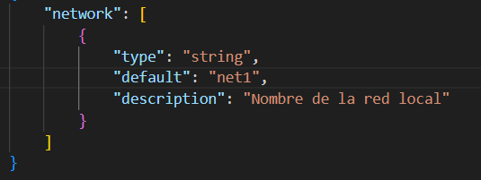

Regeneramos app1 y observamos que `terraform plan` indica un cambio en el trigger
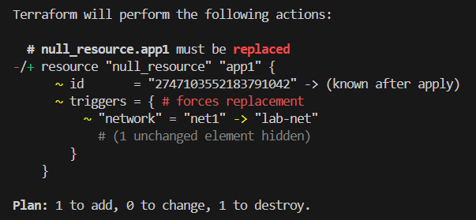

#### Fase 2: Entendiendo la inmutabilidad

#### A. Remediación de 'drift' (out-of-band changes)

En el environment `app2` editamos manualmente main.tf.json, para cambiar `"name":"app2" ->"hacked-app"`. Luego ejecutamos `terraform plan` y vemos un plan que propone revertir ese cambio.
   
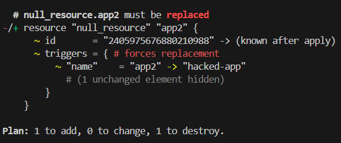

Luego, comprobamos que vuelve a "app2".

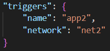
#### B. Migrando a IaC

* **Mini-reto**
 Creamos en un nuevo directorio `legacy/` que contiene un simple `run.ps1` + `config.cfg` con parámetros.

`config.cfg`

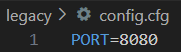

`run.ps1`

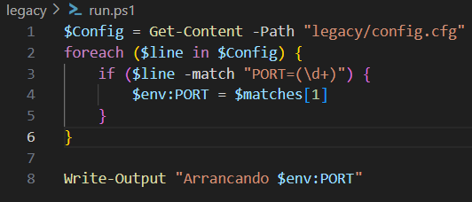

Ejecutamos `run.ps1`

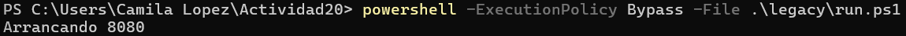

Luego, escribimos un script Python que lea `config.cfg` y `run.sh` para generar automáticamente un par `network.tf.json` + `main.tf.json` equivalente.

`legacy_migrator.py`
```python
import os
import json
import subprocess

LEGACY_DIR = "legacy"
ENV_DIR = "environments/legacy_env"
os.makedirs(ENV_DIR, exist_ok=True)

# Esta parte se encarga de leer el archivo config.cfg y obtener el valor de la variable PORT
config_path = os.path.join(LEGACY_DIR, "config.cfg")
with open(config_path, encoding="utf-16") as f:
    lines = f.readlines()

port = None
for line in lines:
    if line.startswith("PORT="):
        port = line.strip().split("=")[1]
        break

if port is None:
    raise ValueError("No se encontró la variable PORT")

# Esta parte se encarga de leer el archivo run.ps1 y obtener el comando
run_script_path = os.path.join(LEGACY_DIR, "run.ps1")
with open(run_script_path) as f:
    run_script_content = f.read()

#Esta parte se encarga de contruir la plantilla para el archivo network.tf.json que guarda las variables
network_json = {
    "variable": {
        "port": {
            "type": "string",
            "default": port,
            "description": "Puerto del servidor local"
        }
    }
}

with open(os.path.join(ENV_DIR, "network.tf.json"), "w") as f:
    json.dump(network_json, f, indent=4)


#Esta parte se encarga de contruir la plantilla para el archivo main.tf.json que declara los recursos
main_json = {
    "resource": {
        "null_resource": {
            "legacy_server": {
                "triggers": {
                    "port": "${var.port}"
                },
                "provisioner": {
                    "local-exec": {
                        "command": f"echo 'Arrancando ${{var.port}}'"
                    }
                }
            }
        }
    }
}

with open(os.path.join(ENV_DIR, "main.tf.json"), "w") as f:
    json.dump(main_json, f, indent=4)
```

Los archivos se generaron de manera exitosa.

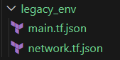

Luego verifique con `terraform plan` que el resultado es igual al script legacy.

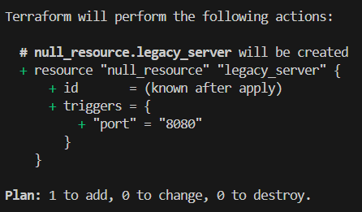

#### Fase 3: Escribiendo código limpio en IaC 

| Conceptos                       | Ejercicio rápido                                                                                               |
| ------------------------------------------ | -------------------------------------------------------------------------------------------------------------- |
| **Control de versiones comunica contexto** | - Haz 2 commits: uno que cambie `default` de `name`; otro que cambie `description`. Revisar mensajes claros. |
| **Linting y formateo**                     | - Instala `jq`. Ejecutar `jq . network.tf.json > tmp && mv tmp network.tf.json`. ¿Qué cambió?                 |
| **Nomenclatura de recursos**               | - Renombra en `main.tf.json` el recurso `null_resource` a `local_server`. Ajustar generador Python.           |
| **Variables y constantes**                 | - Añade variable `port` en `network.tf.json` y usarla en el `command`. Regenerar entorno.                     |
| **Parametrizar dependencias**              | - Genera `env3` de modo que su `network` dependa de `env2` (p.ej. `net2-peered`). Implementarlo en Python.    |
| **Mantener en secreto**                    | - Marca `api_key` como **sensitive** en el JSON y leerla desde `os.environ`, sin volcarla en disco.           |

#### Fase 4: Integración final y discusión

1. **Recorrido** por:

   * Detección de drift (*remediation*).
   * Migración de legacy.
   * Estructura limpia, módulos, variables sensibles.
2. **Preguntas abiertas**:

   * ¿Cómo extenderías este patrón para 50 módulos y 100 entornos?
   * ¿Qué prácticas de revisión de código aplicarías a los `.tf.json`?
   * ¿Cómo gestionarías secretos en producción (sin Vault)?
   * ¿Qué workflows de revisión aplicarías a los JSON generados?


#### Ejercicios

1. **Drift avanzado**

Creamos un recurso "load\_balancer" que dependa de dos `local_server`. 

Creamos el archivo `network.tf.json` que almacena la variable `network`
```json
    "variable": {
        "network": {
            "type": "string",
            "default": "local-net",
            "description": "Nombre de la red local"
        }
    }
```
Luego, creamos el archivo `main.tf.json` que crea dos recursos local_server1 y local_server2, y por último un recurso load_balancer que depende de los dos anteriores

```json
{
    "resource": {
        "null_resource": {
            "local_server1": {
                "triggers": {
                    "name": "server1",
                    "network": "${var.network}"
                },
                "provisioner": {
                    "local-exec": {
                        "command": "echo 'Arrancando local_server1 en red ${var.network}'"
                    }
                }
            },
            "local_server2": {
                "triggers": {
                    "name": "server2",
                    "network": "${var.network}"
                },
                "provisioner": {
                    "local-exec": {
                        "command": "echo 'Arrancando local_server2 en red ${var.network}'"
                    }
                }
            },
            "load_balancer": {
                "depends_on": [
                    "null_resource.local_server1",
                    "null_resource.local_server2"
                ],
                "triggers": {
                    "name": "load_balancer",
                    "network": "${var.network}"
                },
                "provisioner": {
                    "local-exec": {
                        "command": "echo 'Arrancando load_balancer para ${var.network}'"
                    }
                }
            }
        }
    }
}
```

Ahora, simulamos un drift en uno de ellos.
Modificamos manualmente la variable `name` de `server2 -> hacked-server` en el recurso `triggers` de `server2`

```json
"triggers": {
              "name": "hacked-server",
              "network": "local-net"
            }
```
Con el comando `terraform plan` observamos que terrafom indica que se debe reemplazar el recurso que tiene "hacked-server" con uno nuevo que tenga "server2"
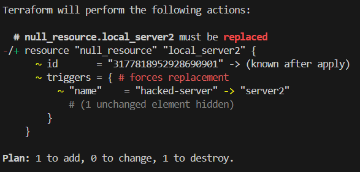

Por último, con `terraform apply` terraform corrige el drift y observamos como regresa a `server2` como se encontraba originalmente
```json
"triggers": {
              "name": "server2",
              "network": "local-net"
            }
```
2. **CLI Interactiva**

   * Refactoriza `generate_envs.py` con `click` para aceptar:

     ```bash
     python generate_envs.py --count 3 --prefix staging --port 3000
     ```

3. **Validación de Esquema JSON**

   * Diseña un JSON Schema que valide la estructura de ambos TF files.
   * Lanza la validación antes de escribir cada archivo en Python.

4. **GitOps Local**

   * Implementa un script que, al detectar cambios en `modules/simulated_app/`, regenere **todas** las carpetas bajo `environments/`.
   * Añade un hook de pre-commit que ejecute `jq --check` sobre los JSON.

5. **Compartición segura de secretos**

   * Diseña un mini-workflow donde `api_key` se lee de `~/.config/secure.json` (no versionado) y documenta cómo el equipo la distribuye sin comprometer seguridad.
