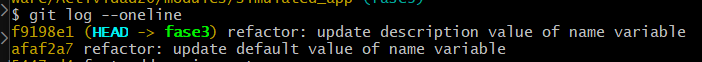
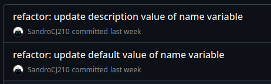
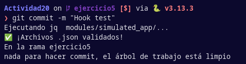

### Actividad: Escribiendo infraestructura como código en un entorno local con Terraform

#### Fase 0: Preparación 
Revisamos el proyecto de la actividad


* La carpeta `modules/simulated_app/` contiene los archivos `main.tf.json` y `network.tf.json`, que son archivos de configuración de Terraform en formato JSON.

* El archivo `generate_envs.py` genera entornos locales a partir de los archivos `main.tf.json` y `network.tf.json`

Verificamos que podemos ejecutar:


####  Fase 1: Expresando el cambio de infraestructura

En `modules/simulated_app/network.tf.json` modificamos el `default` de `"network"` a `"lab-net"`.


Luego, regeneramos `environments/app1` con `python generate_envs.py`. Notamos que se actualizó el directorio `environments/app1/` y sus archivos


Cuando ejecutamos `terraform plan` observamos que detecta un cambio en el trigger del recurso `null_resource`.


* **Pregunta**

  * ¿Cómo interpreta Terraform el cambio de variable? :
  Terraform compara el valor modificado de la variable con el valor registrado en `terraform.tfstate`. Si algún recurso utiliza esta variable, entonces se debe aplicar el cambio. Por otro lado, si dicha variable no se usa en algún recurso entonces no se detectan cambios. 
  * ¿Qué diferencia hay entre modificar el JSON vs. parchear directamente el recurso? :
  Cuando modificamos algun archivo json, estamos modificando el estado deseado que posteriormente puede aplicar dichas modificaciones y generar un nuevo estado actual, mientras que cuando parcheamos directamente el recurso estamos modificando el estado actual sin actualizar la configuracion deseada en json.
  * ¿Por qué Terraform no recrea todo el recurso, sino que aplica el cambio "in-place"? :
  Terraform solo destruye y crea un recurso cuando se modifica alguna variable que se encuentra dentro de triggers
  * ¿Qué pasa si editas directamente `main.tf.json` en lugar de la plantilla de variables? :
  Terraform reconoce el cambio en el recurso porque lo definimos de manera directa en el recurso, el cambio se aplica con terraform apply

#### Procedimiento

En `environments/app1/network.tf.json`, el `default` de la variable network originalmente esta en `"net1"` 


Regeneramos app1 y observamos que `terraform plan` indica un cambio en el trigger


#### Fase 2: Entendiendo la inmutabilidad

#### A. Remediación de 'drift' (out-of-band changes)

En el environment `app2` editamos manualmente main.tf.json, para cambiar `"name":"app2" ->"hacked-app"`. Luego ejecutamos `terraform plan` y vemos un plan que propone revertir ese cambio.
   


Luego, comprobamos que vuelve a "app2".


#### B. Migrando a IaC

* **Mini-reto**
 Creamos en un nuevo directorio `legacy/` que contiene un simple `run.ps1` + `config.cfg` con parámetros.

`config.cfg`


`run.ps1`


Ejecutamos `run.ps1`


Luego, escribimos un script Python que lea `config.cfg` y `run.sh` para generar automáticamente un par `network.tf.json` + `main.tf.json` equivalente.

`legacy_migrator.py`
```python
import os
import json
import subprocess

LEGACY_DIR = "legacy"
ENV_DIR = "environments/legacy_env"
os.makedirs(ENV_DIR, exist_ok=True)

# Esta parte se encarga de leer el archivo config.cfg y obtener el valor de la variable PORT
config_path = os.path.join(LEGACY_DIR, "config.cfg")
with open(config_path, encoding="utf-16") as f:
    lines = f.readlines()

port = None
for line in lines:
    if line.startswith("PORT="):
        port = line.strip().split("=")[1]
        break

if port is None:
    raise ValueError("No se encontró la variable PORT")

# Esta parte se encarga de leer el archivo run.ps1 y obtener el comando
run_script_path = os.path.join(LEGACY_DIR, "run.ps1")
with open(run_script_path) as f:
    run_script_content = f.read()

#Esta parte se encarga de contruir la plantilla para el archivo network.tf.json que guarda las variables
network_json = {
    "variable": {
        "port": {
            "type": "string",
            "default": port,
            "description": "Puerto del servidor local"
        }
    }
}

with open(os.path.join(ENV_DIR, "network.tf.json"), "w") as f:
    json.dump(network_json, f, indent=4)


#Esta parte se encarga de contruir la plantilla para el archivo main.tf.json que declara los recursos
main_json = {
    "resource": {
        "null_resource": {
            "legacy_server": {
                "triggers": {
                    "port": "${var.port}"
                },
                "provisioner": {
                    "local-exec": {
                        "command": f"echo 'Arrancando ${{var.port}}'"
                    }
                }
            }
        }
    }
}

with open(os.path.join(ENV_DIR, "main.tf.json"), "w") as f:
    json.dump(main_json, f, indent=4)
```

Los archivos se generaron de manera exitosa.


Luego verifique con `terraform plan` que el resultado es igual al script legacy.


# Fase 3
### Control de versiones comunica contexto
Se realizaron dos commits, cada uno cambió un campo de la variable name.


### Linting y formateo

Luego de instalar jq se ejecutó el siguiente comando:
```
jq . network.tf.json > tmp && mv tmp network.tf.json
```
**¿Qué cambió?**

Se nota que la indentación y la sangría del archivo network.tf.json ha cambiado. Y justo ese es el objetivo de usar jq, ya que una de las funcionalidades de este comando sirve es formatear archivos. 

Antes:
```json
{
    "variable": [
        {
            "name": [
                {
                    "type": "string",
                    "default": "hello-world",
                    "description": "Nombre del servidor local"
                }
            ]
        },
        {
            "network": [
                {
                    "type": "string",
                    "default": "local-network",
                    "description": "Nombre de la red local"
                }
            ]
        }
    ]
}
```

Después:
```json
{
  "variable": [
    {
      "name": [
        {
          "type": "string",
          "default": "hello-world",
          "description": "Nombre del servidor local"
        }
      ]
    },
    {
      "network": [
        {
          "type": "string",
          "default": "local-network",
          "description": "Nombre de la red local"
        }
      ]
    }
  ]
}

```

### Nomenclatura de recursos
Se cambió el nombre del recurso a "local_server" en main.tf.json

```json
{
  "resource": [
    {
      "null_resource": [
        {
          "local_server": [
            {
              "triggers": {
                "name": "${var.name}",
                "network": "${var.network}"
              },
              "provisioner": [
                {
                  "local-exec": {
                    "command": "echo 'Arrancando servidor ${var.name} en red ${var.network}'"
                  }
                }
              ]
            }
          ]
        }
      ]
    }
  ]
}

```

Además, se tuvo que cambiar la variable config en generate_envs.py para que también tenga el recurso con nombre "local_server" en vez de "app[i]"

```python
config = {
    "resource": [
        {
            "null_resource": [
                {
                    "local_server": [
                        {
                            "triggers": {
                                "name":    env["name"],
                                "network": env["network"],
                                "port": "${var.port}"
                            },
                            "provisioner": [
                                {
                                    "local-exec": {
                                        "command": (
                                            f"echo 'Arrancando servidor "
                                            f"{env['name']} en red {env['network']}'"
                                            f" en el puerto ${var.port}"
                                        )
                                    }
                                }
                            ]
                        }
                    ]
                }
            ]
        }
    ]
}
```

### Variables y constantes

Se añadió la variable port.

```json
{
  "port": [
    {
      "type": "number",
      "default": 8080,
      "description": "Puerto del servidor local"
    }
  ]
}
```

Además, se modificó main.tf.json para que se use en el comando.

```json
"provisioner": [
  {
    "local-exec": {
      "command": "echo 'Arrancando servidor ${var.name} en red ${var.network}, en el puerto ${var.port}'"
    }
  }
]
```

También se tiene que hacer la modificación en generate_envs.py

```python
    config = {
        "resource": [
            {
                "null_resource": [
                    {
                        "local_server": [
                            {
                                "triggers": {
                                    "name":    env["name"],
                                    "network": env["network"],
                                    "port": "${var.port}"
                                },
                                "provisioner": [
                                    {
                                        "local-exec": {
                                            "command": (
                                                f"echo 'Arrancando servidor "
                                                f"{env['name']} en red {env['network']}'"
                                                "en el puerto ${var.port}"
                                            )
                                        }
                                    }
                                ]
                            }
                        ]
                    }
                ]
            }
        ]
    }
```

### Parametrizar dependencias

Para esto se cambia la network del tercer enviroment a net2-peered.

```python
ENVS = []
for i in range(1, 11):
    if i == 3:
        env = {"name": f"app{i}", "network": "net2-peered"}
    else:
        env = {"name": f"app{i}", "network": f"net{i}"}
    ENVS.append(env)
```

### Mantener en secreto
Se añadió una variable "api_key" en network.tf.json
```json
{
  "api_key": [
    {
      "type": "string",
      "description": "Clave API para autentificación",
      "sensitive": true
    }
  ]
}
```

No se añadió el campo default porque no queremos que su valor esté en disco.

En generate_envs.py se usa os.environ para obtener la api_key como una variable de entorno en el sistema llamada "API_KEY"

```python
api_key = os.environ.get("API_KEY")
if api_key is None:
    raise Exception("No se obtuvo la variable de entorno API_KEY")
```


# Fase 4

## Detección de Drift

Para detectar los casos de *drift*, en los que el estado deseado y el actual están diferenciados, se usa `terraform plan`, el cual comparará el archivo de estado de Terraform con los recursos desplegados. Dependiendo de los cambios que se quieran realizar, se puede usar `terraform apply` para regresar al estado deseado.


## Migración de Legacy

La migración de Legacy se llevó a cabo migrando un archivo de configuración `config.cfg` y un script de arranque `run.sh` a una estructura equivalente en Terraform. Esto representa el paso de archivos imperativos, como los del script, a archivos declarativos de configuración de Terraform. Esto mejora su reproducibilidad y versionamiento en comparación a scripts.

Pare verificar que no hay diferencia, se ejecuta `terraform plan` para comparar el estado generado con el esperado.


## Estructura limpia, módulos, variables sensibles

### Control de versiones claro

Para comunicar efectivamente el propósito y lo que se hizo en cada commit, se sigue la convención de colocar primero lo que se hizo en el commit en una sola palabra (refactor, fix, feat, etc...) y describir brevemente esta acción.



### Linting y formateo

Para esto se usó la herramienta `jq` para dar un formato estandarizado a los archivos .json. En particular, esto redujo el tamaño de las tabulaciones y compactó los archivos .json, haciéndolos un poco más fáciles de leer para las personas.


Antes:
```json
{
    "variable": [
        {
            "name": [
                {
                    "type": "string",
                    "default": "hello-world",
                    "description": "Nombre del servidor local"
                }
            ]
        },
        ...
```


Después:
```json
{
  "variable": [
    {
      "name": [
        {
          "type": "string",
          "default": "hello-world",
          "description": "Nombre del servidor local"
        }
      ]
    },
    ...
```


### Nomenclatura de recursos

El nombre de los recursos pasa a ser más expresivo y significativo en lugar de tan solo "null\_resource". Esto facilita a su lectura, mantenimiento y documentación. En particular, se cambió "null\_resource" por "local\_server" en `main.tf.json`.

### Variables y constantes

Se reescribe el código para parametrizar la variable `port` de `network.tf.json`. De esta forma, se evita "hardcodear" variables en el código y se mejora la gestión de versiones, ya que se puede revisar directamente esta variable como tal y no como parte de una cadena final o, en este caso, como un comando.

### Parametrizar dependencias

Se generan *environments* simples con una dependencia hecha explícita, de modo que `env3` dependa de `env2`. Este orden secuencial simula lo que se espera de las dependencias de un ambiente real, las cuales pueden expandirse a través de ambientes y deben ser lidiadas de forma secuencial.

### Mantener en secreto

Se manejan secretos mediante `os.environ` y un archivo de configuración que declara a la clave de API como secreta, sin darle ningún valor por defecto. De este modo, esta clave (cuyo filtrado puede tener consecuencias graves para la empresa), nunca es expuesta en el código y solo es manejada por el equipo de desarrollo.

Todas estas medidas refuerzan nuestro IaC mediante control de versiones y cambios, flexibilidad, seguridad y código limpio.

### Preguntas abiertas

1. ¿Cómo extenderías este patrón para 50 módulos y 100 entornos?

    Entre algunas opciones, se pueden usar:
    
    - Jinja2 de Python o `templatefile` de Terraform para parametrizar la generación de archivos JSON mediante "templates" o archivos base con información repetible entre archivos.
    - Declarar archivos de configuración donde defina los entornos y módulos a generar y se pueda repetir 100 veces.
    - Modificar el script de Python para la generación de estos entornos y módulos.
    
2. ¿Qué prácticas de revisión de código aplicarías a los .tf.json?
   
   Pese a que el código sea generado automáticamente, los cambios hechos por personas pueden variar su estado y ameritar revisiones periódicas. Algunas maneras son:
   
   - Validación automática mediante `terraform validate`, `terraform fmt` y `jq`.
   - Revisar que las variables sean descriptivas y no genéricas.
   - Revisar el historial de modificaciones en commits o en PRs para analizar cambios.
   - Usar `terraform plan` para analizar cualquier drift que se haya generado.
   
3. ¿Cómo gestionarías secretos en producción (sin Vault)?

    - Se pueden usar variables de Terraform marcadas como confidenciales y TF_VARS como variables de entorno para no hardcodearlas en las configuraciones, sino que sean descritas por el desarrollador.
    - Se pueden usar archivos locales no versionados con los secretos necesarios.
    
4. ¿Qué workflows de revisión aplicarías a los JSON generados?
   
   - Se pueden limitar PRs que no tengan archivos generados por el script de Python o de alguna otra forma acordada.
   - Se pueden usar flujos en CI que corran `terraform validate`, `terraform fmt`, `terraform plan` y `jq`, los cuales fallan el build en caso de errores.
   - En hooks pre-commit se puede usar `jq` por su rapidez de ejecución.

## Ejercicios

1. **Drift avanzado**

Creamos un recurso "load\_balancer" que dependa de dos `local_server`. 

Creamos el archivo `network.tf.json` que almacena la variable `network`
```json
    "variable": {
        "network": {
            "type": "string",
            "default": "local-net",
            "description": "Nombre de la red local"
        }
    }
```
Luego, creamos el archivo `main.tf.json` que crea dos recursos local_server1 y local_server2, y por último un recurso load_balancer que depende de los dos anteriores

```json
{
    "resource": {
        "null_resource": {
            "local_server1": {
                "triggers": {
                    "name": "server1",
                    "network": "${var.network}"
                },
                "provisioner": {
                    "local-exec": {
                        "command": "echo 'Arrancando local_server1 en red ${var.network}'"
                    }
                }
            },
            "local_server2": {
                "triggers": {
                    "name": "server2",
                    "network": "${var.network}"
                },
                "provisioner": {
                    "local-exec": {
                        "command": "echo 'Arrancando local_server2 en red ${var.network}'"
                    }
                }
            },
            "load_balancer": {
                "depends_on": [
                    "null_resource.local_server1",
                    "null_resource.local_server2"
                ],
                "triggers": {
                    "name": "load_balancer",
                    "network": "${var.network}"
                },
                "provisioner": {
                    "local-exec": {
                        "command": "echo 'Arrancando load_balancer para ${var.network}'"
                    }
                }
            }
        }
    }
}
```

Ahora, simulamos un drift en uno de ellos.
Modificamos manualmente la variable `name` de `server2 -> hacked-server` en el recurso `triggers` de `server2`

```json
"triggers": {
              "name": "hacked-server",
              "network": "local-net"
            }
```
Con el comando `terraform plan` observamos que terrafom indica que se debe reemplazar el recurso que tiene "hacked-server" con uno nuevo que tenga "server2"


Por último, con `terraform apply` terraform corrige el drift y observamos como regresa a `server2` como se encontraba originalmente
```json
"triggers": {
              "name": "server2",
              "network": "local-net"
            }
```
2. **CLI Interactiva**

   Se usó el paquete clicks para poder recibir parámetros a través de la consola. Además se modificó el diccionario ENVS para que tenga un tercer elemento que haga referencia al puerto del servidor del enviroment. Para obtener los parámetros se implementó la siguiente función:

   ```python
    @click.command()
    @click.option("--count", default=10, help="Número de entornos a generar")
    @click.option("--prefix", default="app", help="Prefijo para los nombres de los entornos")
    @click.option("--port", default="${var.port}", help="Puerto para los entornos")
    def set_up_and_generate_envs(count, prefix, port):
        ENVS = []
        for i in range(1, count + 1):	
            if i == 3:
                env = {"name": f"{prefix}{i}", "network": "net2-peered", "port": f"{port}" }
            else:
                env = {"name": f"{prefix}{i}", "network": f"net{i}", "port": f"{port}" }
            ENVS.append(env)
        
        for env in ENVS:    
            render_and_write(env) 
   ```

   También se modificó config para que command reciba env["port"] en vez de "${var.port}". Y por último se modificó main para que solo llame a la función set_up_and_generate_envs()

3. **Validación de Esquema JSON**

   Se hicieron dos JSON schema para realizar la validación de jsons. Estos son los siguientes:

   main_schema.json:
   ```json
    {
    "$schema": "https://json-schema.org/draft/2020-12/schema",
    "title": "Schema for main.tf.json",
    "type": "object",
    "properties": {
        "resource": {
        "type": "array",
        "items": {
            "type": "object",
            "properties": {
            "null_resource": {
                "type": "array",
                "items": {
                "type": "object",
                "properties": {
                    "local_server": {
                    "type": "array",
                    "items": {
                        "type": "object",
                        "properties": {
                        "triggers": {
                            "type": "object",
                            "properties": {
                            "name": { "type": "string" },
                            "network": { "type": "string" },
                            "port": { "type": "string" }
                            },
                            "required": ["name", "network", "port"],
                            "additionalProperties": false
                        },
                        "provisioner": {
                            "type": "array",
                            "items": {
                            "type": "object",
                            "properties": {
                                "local-exec": {
                                "type": "object",
                                "properties": {
                                    "command": { "type": "string" }
                                },
                                "required": ["command"],
                                "additionalProperties": false
                                }
                            },
                            "required": ["local-exec"],
                            "additionalProperties": false
                            }
                        }
                        },
                        "required": ["triggers", "provisioner"],
                        "additionalProperties": false
                    }
                    }
                },
                "required": ["local_server"],
                "additionalProperties": false
                }
            }
            },
            "required": ["null_resource"],
            "additionalProperties": false
        }
        }
    },
    "required": ["resource"],
    "additionalProperties": false
    }
   ```

   network_schema.json:
   ```json
   {
    "$schema": "https://json-schema.org/draft/2020-12/schema",
    "title": "Schema for network.tf.json",
    "type": "object",
    "properties": {
        "variable": {
        "type": "array",
        "items": {
            "type": "object",
            "patternProperties": {
            "^(name|network|port|api_key)$": {
                "type": "array",
                "items": {
                "type": "object",
                "properties": {
                    "type": { "type": "string" },
                    "default": { },
                    "description": { "type": "string" },
                    "sensitive": { "type": "boolean" }
                },
                "required": ["type", "description"],
                "additionalProperties": false
                }
            }
            },
            "additionalProperties": false
        }
        }
    },
    "required": ["variable"],
    "additionalProperties": false
    }
   ```

   Ambos usan el estándar 2020-12. 

   Además, para realizar la validación en python se usó la librería jsonschema y su función validate()

   ```python
        # Validación de network.tf.json
        network_dst = os.path.join(env_dir, "network.tf.json")
       
        with open(network_dst) as f:
            network_data = json.load(f)
        try:
            validate(instance=network_data, schema=network_schema)
            print(f"network.tf.json válido para {env['name']}")
        except ValidationError as e:
            print(f"Error en network.tf.json para {env['name']}: {e.message}")
            exit(1)

        # Validación de main.tf.json
        try:
            validate(instance=config, schema=main_schema)
            print(f"main.tf.json válido para {env['name']}")
        except ValidationError as e:
            print(f"Error en main.tf.json para {env['name']}: {e.message}")
            exit(1)
   ```

4. **GitOps Local**

   * Implementa un script que, al detectar cambios en `modules/simulated_app/`, regenere **todas** las carpetas bajo `environments/`.
   * Añade un hook de pre-commit que ejecute `jq --check` sobre los JSON.
   
   El script se crea en la carpeta Ejercicio4, como `detect_changes.py`.
   
  ```python
def take_snapshot(directory):
    snapshot = {}
    for root, _, files in os.walk(directory):
        for f in files:
            path = os.path.join(root, f)
            try:
                stat = os.stat(path)
                snapshot[path] = stat.st_mtime
            except Exception:
                pass
    return snapshot

def compress_snapshot(snapshot):
    json_data = json.dumps(snapshot)
    return zlib.compress(json_data.encode("utf-8"))

def decompress_snapshot(data):
    json_data = zlib.decompress(data).decode("utf-8")
    return json.loads(json_data)

def load_previous_snapshot():
    if not os.path.exists(SNAPSHOT_FILE):
        return None
    with open(SNAPSHOT_FILE, "rb") as f:
        data = f.read()
        return decompress_snapshot(data)

def save_snapshot(snapshot):
    data = compress_snapshot(snapshot)
    with open(SNAPSHOT_FILE, "wb") as f:
        f.write(data)

def regenerate():
    print("¡Cambios detectados! Regenerando...")
    subprocess.run(["python", REGENERATE_SCRIPT])
    print("Regeneración completada")

def main():
    current_snapshot = take_snapshot(WATCHED_DIR)
    previous_snapshot = load_previous_snapshot()

    if previous_snapshot != current_snapshot:
        regenerate()
        save_snapshot(current_snapshot)
    else:
        print("No se detectaron cambios. No se regenera nada.")
``` 

Esencialmente, lee los archivos de la carpeta `modules/simulated_apps/` y las comprime en un archivo `snapshot.bin`. Llamadas posteriores del script comparan el snapshot con el estado actual de los archivos mediante sus hashes. Si son diferentes, entonces se llama `generate_envs.py` para regenerar los ambientes nuevamentes.

Para el hook pre-commit, este llama directamente al comando `jq` para verificar el formato de los archivos .json en `modules/simulated_apps/` (la bandera `--check` no existe).

```bash
#!/bin/bash

TARGET_DIR="modules/simulated_app/"

echo "Ejecutando jq  $TARGET_DIR..."

find "$TARGET_DIR" -name "*.json" -print0 | while IFS= read -r -d '' file; do
  if ! jq  . "$file" >/dev/null 2>&1; then
    echo "❌ .json no válido en: $file"
    exit 1
  fi
done

echo "✅ ¡Archivos .json validados!"
```

Ejecución del hook:



5. **Compartición segura de secretos**

   * Diseña un mini-workflow donde `api_key` se lee de `~/.config/secure.json` (no versionado) y documenta cómo el equipo la distribuye sin comprometer seguridad.
   
   Se crea un archivo no versionado (documentado en .gitignore) en `.config/secure.json` con una clave API de prueba:
   
  ```json
{
  "api_key": "l33t_k3y"
}
``` 

En el script de `generate_envs.py` ya se importan claves desde `os.environ`, pero también se puede crear una función que implemente la lectura de la clave API a modo de workflow.

```python
# Ejercicio 5
# Leer clave API en .config/secure.json (no versionado)
def get_api_key():
    config_path = os.path.join(os.path.dirname(__file__), '.config', 'secure.json')
    with open(config_path) as f:
        config = json.load(f)
    return config.get('api_key')
```

Para compartir este secreto sin comprometer la seguridad, se pueden usar administradores de contraseñas y secretos como 1Password que nos dan la opción de compartir elementos particulares de forma segura. Otra opción viable es usar la opción de manejo de secretos de GitHub y usar estas variables de forma dinámica durante la construcción o despliegue. En su defecto, se pueden compartir estas claves enviando mensajes por aplicaciones encriptadas E2E.

Además, se debe documentar el uso de secretos en el código en documentación interna o directamente en el `README.md` para que quede claro en todo el equipo el uso de estas variables.
