### Actividad: Patrones para módulos de infraestructura

#### Fase 1: Exploración y análisis

Para cada patrón, localizamos el archivo correspondiente y respondimos:

##### 1. Singleton

```python
# singleton.py
import threading
from datetime import datetime

class SingletonMeta(type):
    _instances: dict = {}
    _lock: threading.Lock = threading.Lock()

    def __call__(cls, *args, **kwargs):
        with cls._lock:
            if cls not in cls._instances:
                instance = super().__call__(*args, **kwargs)
                cls._instances[cls] = instance
        return cls._instances[cls]

class ConfigSingleton(metaclass=SingletonMeta):
    def __init__(self, env_name: str):
        self.env_name = env_name
        self.settings: dict = {}
        self.created_at: str = datetime.utcnow().isoformat()
```

* **Tarea**: Explica cómo `SingletonMeta` garantiza una sola instancia y el rol del `lock`.

* **Respuesta**: 
  - El método `__call__` es esencial para este patrón. Este método verifica si existe una instancia en memoria de esta clase; si es que ya existe en memoria, ya no es instanciada y devuelve la que existe en memoria. Caso contrario, si ya existe, es guardada en un diccionario `_instances`.
  - `threading.Lock()` asegura que la labor de creación sea manejado por un solo hilo. Caso contrario, pueden generarse condiciones de carrera y violar la seguridad de hilos o *thread safety*.

#### 2. Factory

```python
# factory.py
import uuid
from datetime import datetime

class NullResourceFactory:
    @staticmethod
    def create(name: str, triggers: dict = None) -> dict:
        triggers = triggers or {
            "factory_uuid": str(uuid.uuid4()),
            "timestamp": datetime.utcnow().isoformat()
        }
        return {
            "resource": {
                "null_resource": {
                    name: {"triggers": triggers}
                }
            }
        }
```

* **Tarea**: Detalla cómo la fábrica encapsula la creación de `null_resource` y el propósito de sus `triggers`.

* **Respuesta**:
  - La fábrica encapsula la creación de `null_resource` solo requiriendo dos atributos, el nombre y sus triggers, que el cliente puede pasar. Si existen triggers, estos son usados; casos contrarios se generan datos en tiempo de ejecución. El cliente no tiene que preocuparse de estructurar el JSON para `null_resource`, tan solo de pasar su nombre y triggers.
  - Los triggers, en este caso, garantizan que el recurso sea único mediante `factory_uuid` y `timestamp`, lo cual lo identifican de manera única y fuerza la recreación de estos recursos. Es decir, Terraform ve que siempre ha cambiado algo.


#### 3. Prototype

```python
# prototype.py
from copy import deepcopy
from typing import Callable

class ResourcePrototype:
    def __init__(self, template: dict):
        self.template = template

    def clone(self, mutator: Callable[[dict], None]) -> dict:
        new_copy = deepcopy(self.template)
        mutator(new_copy)
        return new_copy
```

* **Tarea**: Dibuja un diagrama UML del proceso de clonación profunda y explica cómo el **mutator** permite personalizar cada instancia.

* **Resolución*:

  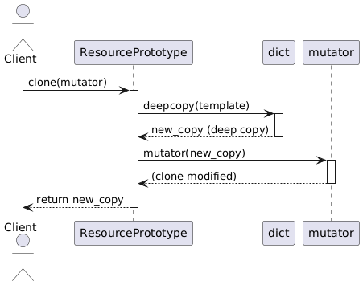

  1. El cliente llama a `clone(mutator)` en el prototipo.
  2. El prototipo hace una copia profunda (deepcopy) del diccionario de plantilla (template).
  3. `mutator` modifica esta copia.
  4. La copia modificada es devuelta el usuario.
  
  - `mutator` es una función pasada por el usuario que permite modificar la copia creada del prototipo. Su comportamiento por defecto es de `lambda d: d`, lo que significa que no modifica la copia si es que el usuario no pasa ninguna función. Después de que el prototipo sea creado, se llama a `mutator(new_copy)` para aplicar la función `mutator` a la copia nueva, la cual es retornada tras esto.
  
    Un ejemplo sencillo es el siguiente:
    
    ```python
    def add_tag(resource_dict):
        resource_dict["tags"] = {"env": "dev"}

    proto = ResourcePrototype({"name": "my_resource"})

    cloned = proto.clone(add_tag)
    ```
    
    Este ejemplo pasa como `mutator` a la función `add_tag()`, la cual agrega un nuevo tag a la copia del prototipo.

#### 4. Composite

```python
# composite.py
from typing import List, Dict

class CompositeModule:
    def __init__(self):
        self.children: List[Dict] = []

    def add(self, block: Dict):
        self.children.append(block)

    def export(self) -> Dict:
        merged: Dict = {"resource": {}}
        for child in self.children:
            # Imagina que unimos dicts de forma recursiva
            for rtype, resources in child["resource"].items():
                merged["resource"].setdefault(rtype, {}).update(resources)
        return merged
```

* **Tarea**: Describe cómo `CompositeModule` agrupa múltiples bloques en un solo JSON válido para Terraform.

* **Respuesta**:
- La lista _children almacena todos los recursos que se van agregando. Luego, el método export() recorre la lista _children y fusiona los bloques en un único diccionario.

#### 5. Builder

```python
# builder.py
import json
from composite import CompositeModule
from factory import NullResourceFactory
from prototype import ResourcePrototype

class InfrastructureBuilder:
    def __init__(self):
        self.module = CompositeModule()

    def build_null_fleet(self, count: int):
        base = NullResourceFactory.create("app")
        proto = ResourcePrototype(base)
        for i in range(count):
            def mutator(block):
                # Renombrar recurso "app" a "app_<i>"
                res = block["resource"]["null_resource"].pop("app")
                block["resource"]["null_resource"][f"app_{i}"] = res
            self.module.add(proto.clone(mutator))
        return self

    def export(self, path: str = "terraform/main.tf.json"):
        with open(path, "w") as f:
            json.dump(self.module.export(), f, indent=2)
```

* **Tarea**: Explica cómo `InfrastructureBuilder` orquesta Factory -> Prototype -> Composite y genera el archivo JSON final.

* **Respuesta**:

- En el método build_null_fleet() se crea un recurso reutilizable a partir de  NullResourceFactory aplicando el patron de diseño Factory. Luego clona y personaliza recursos aplicando el patron Prototype, por último añade recursos al módulo aplicando el patron Composite. 

- En el método add_custom_resource() se crea un recurso a partir de  NullResourceFactory aplicando el patron de diseño Factory. Luego se añade dicho recurso al módulo aplicando el patron Composite.

- Finalmente el método export() escribe JSON a disco 


#### Fase 2: Ejercicios prácticos 


#### Ejercicio 2.1: Extensión del Singleton

Añadimos un método `reset()` que limpie `settings` pero mantenga `created_at`.

* **Código de partida**:

  ```python
  class ConfigSingleton(metaclass=SingletonMeta):
      # ...
      def reset(self):
          # TODO: implementar
  ```
* **Validación**:

  ```python
  c1 = ConfigSingleton("dev")
  created = c1.created_at
  c1.settings["x"] = 1
  c1.reset()
  assert c1.settings == {}
  assert c1.created_at == created
  ```

* **Resolución**

Se crea el método `reset()` que llama a `clear()`. Se prefiere esto a reasignar el diccionario a una instancia vacía para que `settings` siga apuntando a la misma instancia en lugar de apuntar a una nueva, lo cual puede hacer que el diccionario antiguo siga en memoria. De esta forma, no se toca `created_at` y se respeta el patrón singleton.

```python
    # Ejercicio 2.1:
    # Extensión de Singleton con método reset
    def reset(self):
        self.settings.clear()
```

Para verificar su funcionamiento, se define un test y se ejecuta con `pytest`.

```python
def test_reset():
    c1 = ConfigSingleton("dev")
    created = c1.created_at
    c1.settings["x"] = 1
    c1.reset()
    assert c1.settings == {}
    assert c1.created_at == created
```

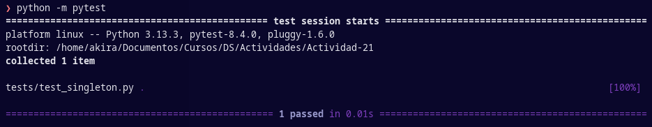

#### Ejercicio 2.2: Variación de la Factory

Creamos una clase `TimestampedNullResourceFactory` que acepte un `fmt: str`.

  ```python
  class TimestampedNullResourceFactory(NullResourceFactory):
    @staticmethod
    def create(name: str, fmt: str) -> dict:
        ts = datetime.utcnow().strftime(fmt)
        triggers = {
            "factory_uuid": str(uuid.uuid4()),
            "timestamp": ts
        }
        return {
            "resource": [{
                "null_resource": [{
                    name: [{
                        "triggers": triggers
                    }]
                }]
            }]
        }
  ```
* **Prueba**: Generamos recurso con formato `'%Y%m%d'` 
 ```python
    block = TimestampedNullResourceFactory.create("my_timestamped", "%Y%m%d")
    builder._module.add(block)
```
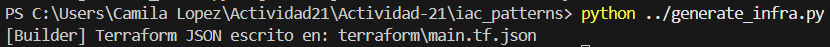

Verificamos que en `main.tf.json` se ha creado el nuevo recurso "my_timestamped" 

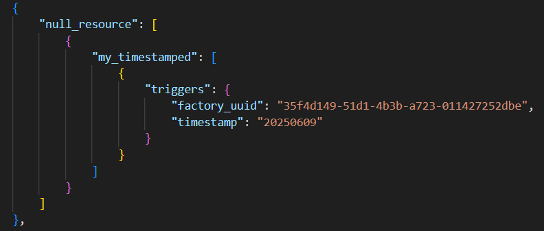

Luego, ejecutamos `terraform plan` y observamos que se planea crear dicho nuevo recurso

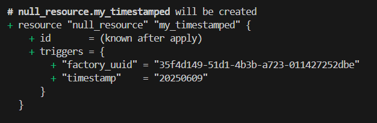

Ejecutamos `terraform apply` de manera exitosa


Verificamos la presencia del recurso en `tf.state`

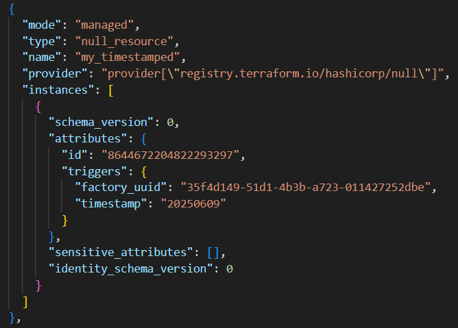
#### Ejercicio 2.3: Mutaciones avanzadas con Prototype

* **Objetivo**: Clonar un prototipo y, en el mutator, añadir un bloque `local_file`.
* **Referencia**:

  ```python
  def add_welcome_file(block: dict):
      block["resource"]["null_resource"]["app_0"]["triggers"]["welcome"] = "¡Hola!"
      block["resource"]["local_file"] = {
          "welcome_txt": {
              "content": "Bienvenido",
              "filename": "${path.module}/bienvenida.txt"
          }
      }
  ```
* **Resultado**: Al `terraform apply`, genera `bienvenida.txt`.

#### Ejercicio 2.4: Submódulos con Composite

 Modificamos `CompositeModule.add()` para soportar submódulos:

  ```python
  # composite.py (modificado)
  def export(self):
      merged = {"module": {}, "resource": {}}
      for child in self.children:
          if "module" in child:
              merged["module"].update(child["module"])
          # ...
  ```
* **Tarea**: Crea dos submódulos "network" y "app" en la misma export y valida con Terraform.

* **Resolución**: 
  Código export completo:
  ```python
        merged = {"module": {}, "resource": {}}
        for child in self._children:
            # Llamadas recursivas
            if isinstance(child, CompositeModule):
                child_export = child.export()
            else:
                child_export = child

            if "module" in child_export:
                merged["module"].update(child_export["module"])
            if "resource" in child_export:
                for rtype, resources in child_export["resource"].items():
                    merged["resource"].setdefault(rtype, {}).update(resources)
        return merged
  ```

#### Ejercicio 2.5: Builder personalizado

En `InfrastructureBuilder`, implementamos `build_group(name: str, size: int)`:

  ```python
  def build_group(self, name: str, size: int):
        base = NullResourceFactory.create(name)
        proto = ResourcePrototype(base)
        group = CompositeModule()
        for i in range(size):
            def mut(block, idx=i):
                """
                Modifica el nombre del recurso clonado y añade un trigger de índice.
                """
                res_block = block["resource"][0]["null_resource"][0]

                # obtiene el nombre original del recurso
                original_name = next(iter(res_block.keys()))

                # genera el nuevo nombre con el índice idx
                new_name = f"{original_name}_{idx}"

                # renombra la clave en el diccionario
                res_block[new_name] = res_block.pop(original_name)

                # añade el trigger de índice
                res_block[new_name][0]["triggers"]["index"] = idx
            clone = proto.clone(mut).data
            group.add(clone)
        self._module.add({"module": {name: group.export()}})
        return self
  ```
* **Validación**: Exportar a JSON y revisar anidamiento `module -> <name> -> resource`.

```python
    builder = InfrastructureBuilder()
    builder.build_group("my_group", 3)
    builder.export("terraform/my_group.tf.json")
```

Generamos nuevamente la infraestructura, que ahora genera el archivo `"my_group.tf.json"`
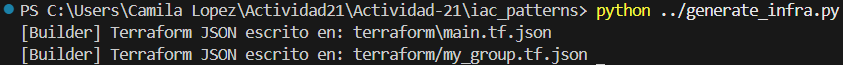
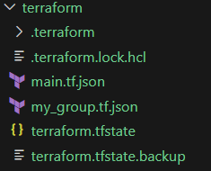

Verificamos que el contenido de `"my_group.tf.json"` corresponde al submódulo de nombre `my_group` el cual contiene 3 recursos
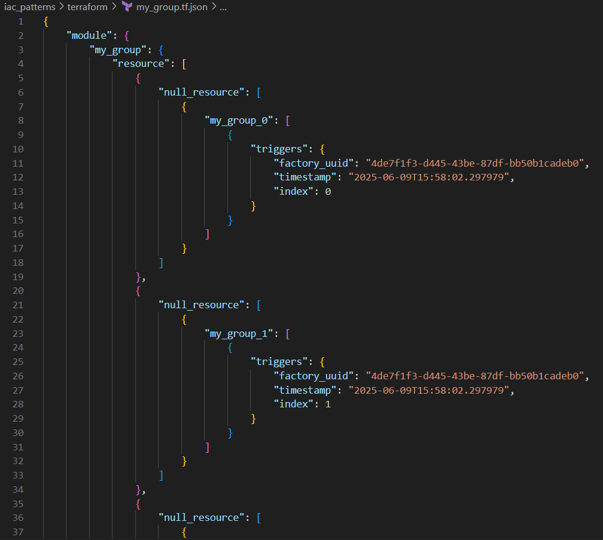


#### Fase 3: Desafíos teórico-prácticos

#### 3.1 Comparativa Factory vs Prototype

* **Contenido** (\~300 palabras): cuándo elegir cada patrón para IaC, costes de serialización profundas vs creación directa y mantenimiento.

#### 3.2 Patrones avanzados: Adapter (código de referencia)

* **Implementación**:

  ```python
  # adapter.py
  class MockBucketAdapter:
      def __init__(self, null_block: dict):
          self.null = null_block

      def to_bucket(self) -> dict:
          # Mapear triggers a parámetros de bucket simulado
          name = list(self.null["resource"]["null_resource"].keys())[0]
          return {
              "resource": {
                  "mock_cloud_bucket": {
                      name: {"name": name, **self.null["resource"]["null_resource"][name]["triggers"]}
                  }
              }
          }
  ```
* **Prueba**: Inserta en builder y exporta un recurso `mock_cloud_bucket`.

#### 3.3 Tests automatizados con pytest

* **Ejemplos**:

  ```python
  def test_singleton_meta():
      a = ConfigSingleton("X"); b = ConfigSingleton("Y")
      assert a is b

  def test_prototype_clone_independent():
      proto = ResourcePrototype(NullResourceFactory.create("app"))
      c1 = proto.clone(lambda b: b.__setitem__("foo", 1))
      c2 = proto.clone(lambda b: b.__setitem__("bar", 2))
      assert "foo" not in c2 and "bar" not in c1
  ```

#### 3.4 Escalabilidad de JSON

Medimos el tamaño de `terraform/main.tf.json` para `build_null_fleet(15)` vs `(150)`.

```python
    builder = InfrastructureBuilder(env_name=config.env_name)
    builder.build_null_fleet(15).export("terraform/main15.tf.json")

    builder = InfrastructureBuilder(env_name=config.env_name)
    builder.build_null_fleet(150).export("terraform/main150.tf.json")
```
Se generan exitosamente `main15.tf.json` y `main150.tf.json`

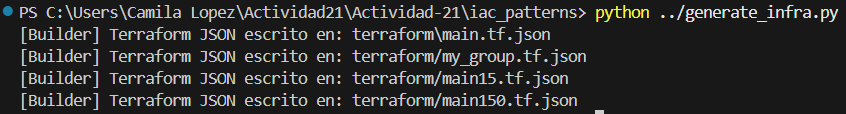

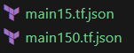

Verificamos que los archivos main15.tf.json y main150.tf.json, contienen 15 y 150 recursos creados respectivamente.
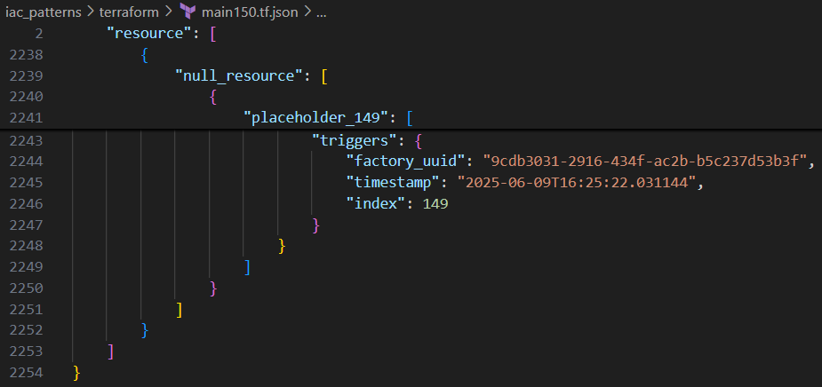

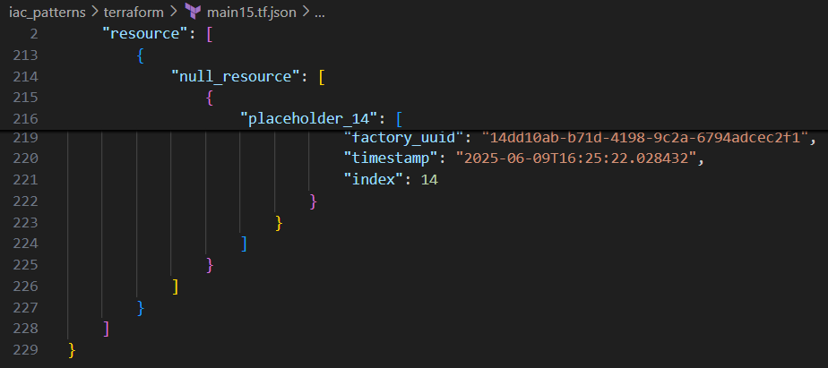

Implementamos un código en python para medir el tamaño de cada archivo json
```python
    import os

    size_15 = os.path.getsize("terraform/main15.tf.json")
    size_150 = os.path.getsize("terraform/main150.tf.json")

    print(f"Tamaño de 15 recursos: {size_15} bytes")
    print(f"Tamaño de 150 recursos: {size_150} bytes")
```
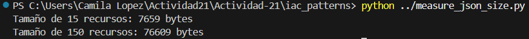

* **Discusión**: impacto en CI/CD, posibles estrategias de fragmentación.
El tamaño del archivo crece linealmente con la cantidad de recursos, por lo que la ejecución de terraform plan y terraform apply toman más tiempo en parsear y comparar. Las herramientas de CI también tardan más en procesar los cambios. Como posible estrategia podemos dividir los recursos comunes en módulos físicos y referenciarlos mediante source, lo que reduce el tamaño del archivo principal y también incrementa la reutilización. Los tiempos de ejecución de CI/CD son más cortos tambien.
