## **Actividad: Rebase, Cherry-Pick y CI/CD en un entorno ágil**

#### **Parte 1: git rebase para mantener un historial lineal**

Pasos Previos: Se creó el repositorio `prueba-git-rebase` con un commit inicial en `main` que incluía un `README.md`. Luego se trabajó en la rama `new-feature` agregando `NewFeature.md`, mientras que en paralelo, en `main`, se hizo otro commit con `Updates.md`, generando una bifurcación en el historial.

> **Pregunta:** Presenta el historial de ramas obtenida hasta el momento.

   El historial de commits se bifurca, cada rama tiene su propio camino a partir del commit original.
   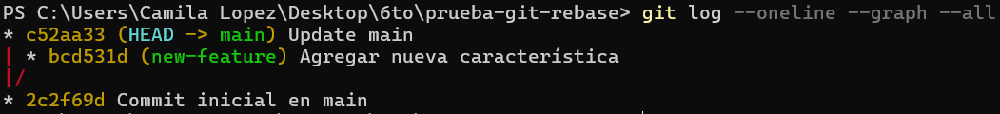

   > **Tarea**: Realiza el rebase de `new-feature` sobre `main`

Se realizó el rebase de `new-feature` sobre `main` exitosamente
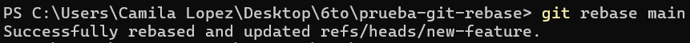

Luego de aplicar el rebase, ahora el historial de `new-feature` se volvió lineal y el hash del commit cambió a `e516815`, ya que es un nuevo commit reescrito.
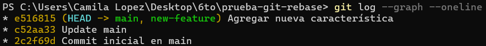


> **Momento de fusionar y completar el proceso de git rebase:**

Se fusiono `new-feature` y `main` exitosamente
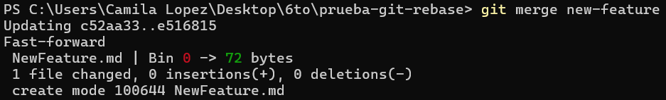

   Luego de realizar una fusión _fast-forward_, las ramas `main` y `new-feature` quedaron alineadas, ya que ambas HEADs ahora apuntan al mismo commit.
   


#### Parte 2: **git cherry-pick para la integración selectiva de commit**
Pasos Previos: Se creó un nuevo repositorio llamado `prueba-cherry-pick` con un commit inicial en `main` que incluía el archivo `README.md`. Luego se creó la rama `add-base-documents`, donde se agregaron y commitearon dos archivos: `CONTRIBUTING.md` y `LICENSE.txt`, cada uno con su respectivo commit. 

> **Pregunta:** Muestra un diagrama de como se ven las ramas en este paso.

El historial de la rama refleja los cambios de forma secuencial.
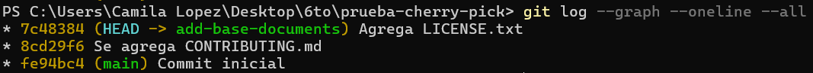

> **Tarea: Haz cherry-pick de un commit de add-base-documents a main:**

Se eligió el commit `7c48384` de la rama `add-base-documents` para hacer un _cherry-pick_ en la rama `main`, permite aplicar específicamente ese cambio sin necesidad de fusionar toda la rama.
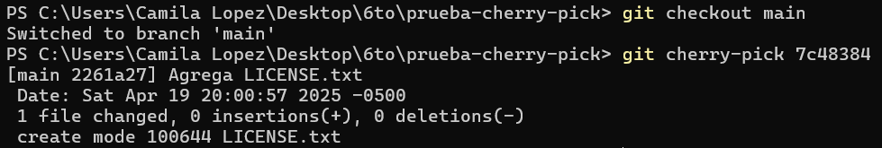
 > Revisa el historial nuevamente:
   
El nuevo commit contiene los mismos cambios, pero con un hash diferente
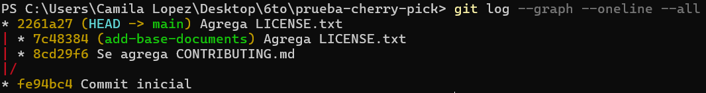


##### **Preguntas de discusión:**

1. ¿Por qué se considera que rebase es más útil para mantener un historial de proyecto lineal en comparación con merge?  
	El comando rebase reescribe el historial de commits al aplicar los cambios de una rama sobre la base de otra. En comparación a merge que genera un merge commit que hace que el historial se vea ramificado, rebase mantiene un histoail lineal y mas limpio

2. ¿Qué problemas potenciales podrían surgir si haces rebase en una rama compartida con otros miembros del equipo?  
	El `rebase` reescribe el historial, lo que hace que se pierdan las referencias a los antiguos commits antes de aplicar el rebase. Si otro miembro del equipo estaba trabajando sobre esos commits, pueden surgir problemas como duplicados o pérdida de trabajo, ya que sus referencias de commit ya no coincidirán con el nuevo historial reescrito.

3.  ¿En qué se diferencia cherry-pick de merge, y en qué situaciones preferirías uno sobre el otro? 
	`cherry-pick` selecciona un commit específico de otra rama y lo aplica sobre la rama actual, mientras que `merge` combina el contenido de dos ramas completas en un único commit de fusión. Prefiero usar `cherry-pick` cuando solo necesito aplicar un cambio específico de manera inmediata, como una corrección de bug, sin integrar toda la rama. En cambio, utilizo `merge` cuando quiero combinar dos ramas completas con todos sus cambios y commits, por ejemplo, al finalizar una característica o tarea.

4. ¿Por qué es importante evitar hacer rebase en ramas públicas?
	Es importante evitar hacer `rebase` en ramas públicas porque reescribir el historial de commits cambia los identificadores de commit (hashes), lo que puede generar conflictos con los colaboradores que ya han clonado esa rama. Si otros miembros del equipo han basado su trabajo en esos commits, tendrán que resolver conflictos al sincronizar sus ramas.


#### **Ejercicios teóricos**

1. **Diferencias entre git merge y git rebase**  
   - **`git merge`** combina el historial de dos ramas manteniéndolo tal cual, generando un _commit de fusión_ que refleja la unión. Se usa `merge` para mantener trazabilidad entre ramas de funcionalidades y su integración en `main`.
   
   - **`git rebase`** reescribe el historial moviendo los commits de una rama como si hubieran sido creados sobre otra, generando un historial más lineal. Esto ayuda a que el historial sea mas simple.  Se usa `rebase` para limpiar y linealizar una feature branch antes de hacer merge, especialmente si otros han trabajado sobre `main` en paralelo.


2. **Relación entre git rebase y DevOps**  
   `git rebase` mantiene un historial lineal, lo que hace mucho más fácil depurar errores. También reduce conflictos en la pipeline al evitar esos commits de fusión que se cruzan entre ramas, que suelen romper builds o tests. Además, simplifica la integración automática, porque los scripts de CI/CD funcionan mejor cuando el historial es limpio y directo. 

3. **Impacto del git cherry-pick en un equipo Scrum**  
    `git cherry-pick` te permite tomar commits específicos de una rama y aplicarlos en otra sin tener que hacer merge de todo. Es súper útil cuando solo una parte del trabajo necesita ir a producción, pero el resto aún no está terminado. Sin embargo, puede generar conflictos si los commits dependen de otros que no se cherry-pickearon.


#### **Ejercicios prácticos**

1. **Simulación de un flujo de trabajo Scrum con git rebase y git merge**

   Después de crear el repositorio y aplicar los commits iniciales, el historial es el siguiente: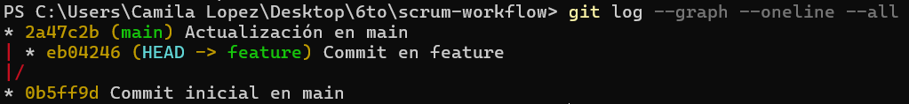
>**Pregunta: ¿Qué sucede con el historial de commits después del rebase?**

   Después de un rebase, el historial de commits se vuelve lineal. los commits de la rama se reaplican desde el último commit de la rama base (`main`), lo que cambia sus hashes porque se crean nuevos commits con la misma información pero diferente referencia de padre.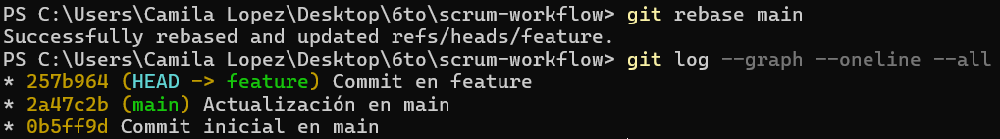

   
>**Pregunta: ¿En qué situación aplicarías una fusión fast-forward en un proyecto ágil?**

   Aplicaría una fusión _fast-forward_ en un proyecto ágil cuando la rama `main` no ha tenido nuevos commits desde que se creó la rama de trabajo,  así avanzaría el puntero de `main` directamente sin crear un commit de fusión adicional.

2. **Cherry-pick para integración selectiva en un pipeline CI/CD**

	Despúes de la creación del repositorio, los commits este es el historial de commits. En el siguiente paso haremos cherry picking de 9558997 commit de feature sobre main
	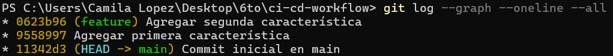

	Hacemos cherry pick de la primera caracteristica en feature a la rama main, se crea otro hash
	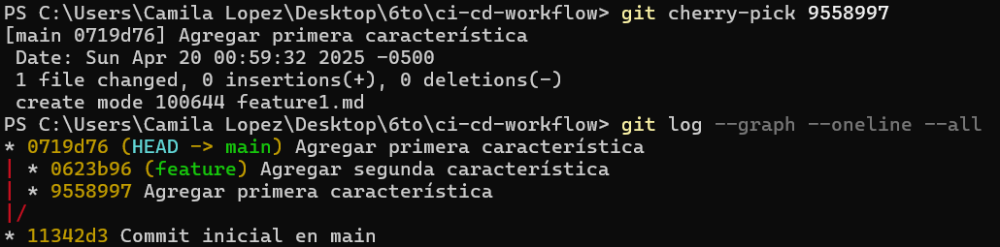

**Preguntas:**
   - ¿Cómo utilizarías cherry-pick en un pipeline de CI/CD para mover solo ciertos cambios listos a producción? 
	Utilizaría `cherry-pick` en un pipeline de CI/CD para mover solo los commits específicos y aprobados desde una rama de desarrollo, asegurando que solo los cambios listos se desplieguen sin introducir código no validado.

   - ¿Qué ventajas ofrece cherry-pick en un flujo de trabajo de DevOps?
    Cherry-pick ofrece la ventaja de reaplicar únicamente los commits deseados en lugar de mezclar toda una rama, lo que brinda un control más fino sobre qué cambios se integran y reduciendo riesgos

#### **Git, Scrum y Sprints**

#### **Fase 1: Planificación del sprint (sprint planning)**

**Ejercicio 1: Crear ramas de funcionalidades (feature branches)**

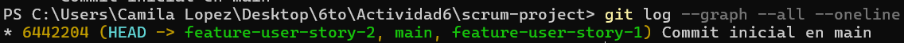

**Pregunta:** ¿Por qué es importante trabajar en ramas de funcionalidades separadas durante un sprint?
Es importante trabajar en ramas de funcionalidades separadas durante un sprint para mantener el historial claro, organizar los commits por funcionalidad y evitar que los cambios interfieran con otras funciones en desarrollo

#### **Fase 2: Desarrollo del sprint (sprint execution)**

**Ejercicio 2: Integración continua con git rebase**

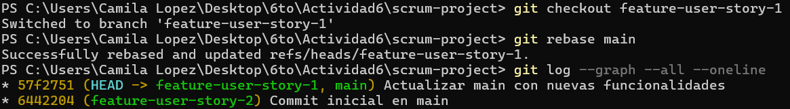


**Pregunta:** ¿Qué ventajas proporciona el rebase durante el desarrollo de un sprint en términos de integración continua?
El rebase durante el desarrollo de un sprint permite integrar los últimos cambios de la rama principal en las ramas de funcionalidad, asegurando compatibilidad continua, y mantiene el historial lineal

#### **Fase 3: Revisión del sprint (sprint review)**

**Ejercicio 3: Integración selectiva con git cherry-pick**
Se aplicó la funcionalidad lista con `cherry-pick` a `main`
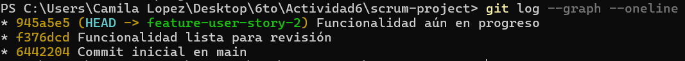
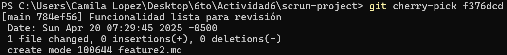
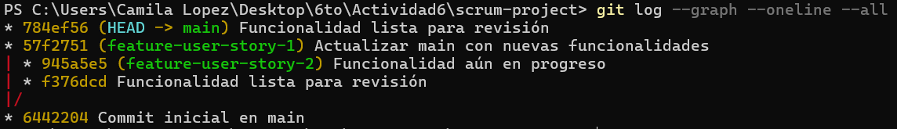

**Pregunta:** ¿Cómo ayuda `git cherry-pick` a mostrar avances de forma selectiva en un sprint review?
`git cherry-pick` ayuda en un sprint review al permitir reaplicar commits específicos que representan funcionalidades ya terminadas, mostrando solo los avances listos sin incluir cambios en progreso

#### **Fase 4: Retrospectiva del sprint (sprint retrospective)**

**Ejercicio 4: Revisión de conflictos y resolución**
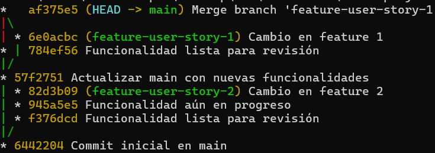

Los commits `620acbc` y `82d3b09` modifican la misma línea de un archivo, Git no puede resolver automáticamente cuál de los cambios mantener, y por eso se presenta un conflicto.


**Pregunta**: ¿Cómo manejas los conflictos de fusión al final de un sprint? ¿Cómo puede el equipo mejorar la comunicación para evitar conflictos grandes?
Una alternativa es abrir el archivo en conflicto en cuestión y de manera manual resolver el conflicto.


![[Pasted image 20250420074928.png]]
El equipo puede mejorar la comunicación para evitar conflictos grandes mediante integraciones frecuentes, asegurándose de que los miembros estén al tanto de en qué áreas están trabajando otros, utilizando ramas pequeñas y específicas para cada tarea.

#### **Fase 5: Fase de desarrollo, automatización de integración continua (CI) con git rebase**

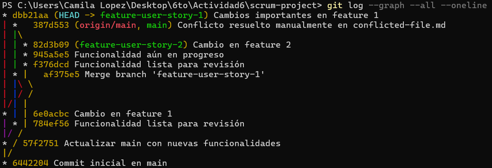  
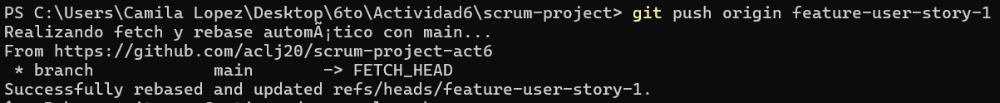  
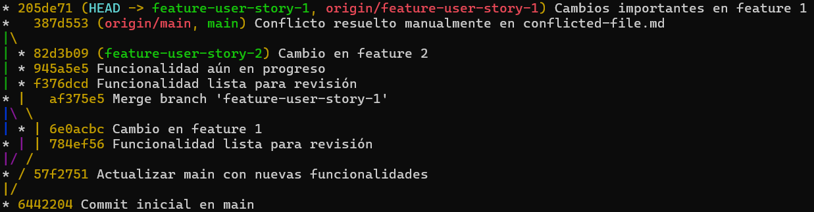


**Pregunta**: ¿Qué ventajas y desventajas observas al automatizar el rebase en un entorno de CI/CD?
Automatizar el rebase en un entorno de CI/CD tiene la ventaja de mantener un historial lineal y una mejor integración continua. Sin embargo, tiene desventajas, como el cambio de hash de los commits, lo que obliga a realizar un `push` forzado que puede sobrescribir cambios en el repositorio remoto.


### **Navegando conflictos y versionado en un entorno devOps**


#### **Ejemplo:**

1. **Inicialización del proyecto y creación de ramas**
	
2. **Fusión y resolución de conflictos**

   - **Paso 1**: Intenta fusionar feature-branch en main. 
   - **Paso 2**: Usa `git status` para identificar los archivos en conflicto, examina los archivos afectados.
   

   
   Mantenemos los cambios de nuestra rama con `git checkout --ours`: Este comando nos permite resolver conflictos de fusión conservando los cambios de nuestra rama actual y descartando los de la rama fusionada.
     
   


3. **Simulación de fusiones y uso de git diff**

   - **Paso 1**: Simula una fusión usando `git merge --no-commit --no-ff` para ver cómo se comportarían los cambios antes de realizar el commit.
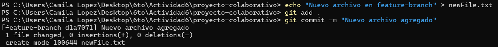  
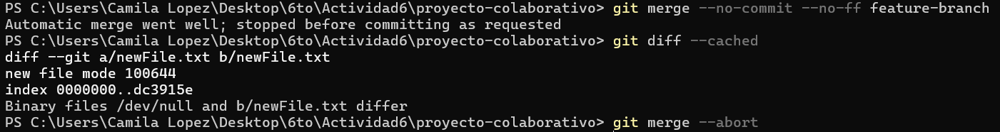

3. **Uso de git mergetool**

    

   - **Paso 2**: Usa la herramienta gráfica para resolver un conflicto de fusión.
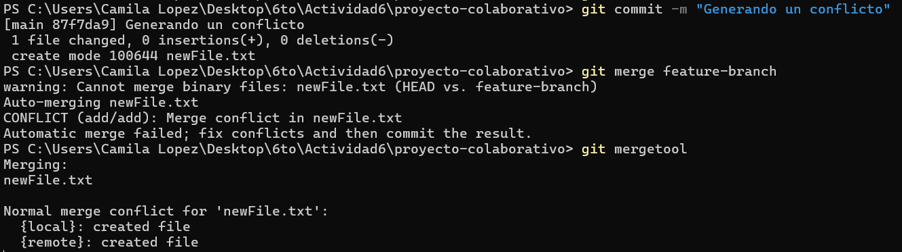
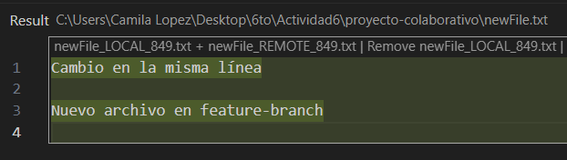
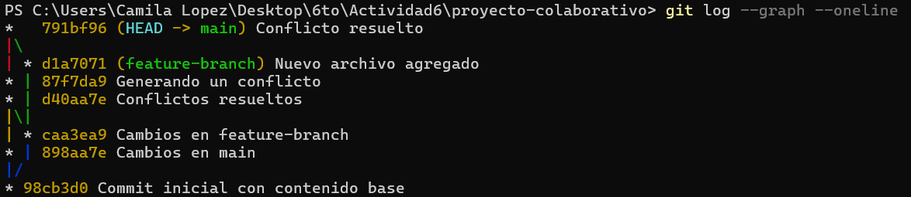


5. **Uso de git revert y git reset**

   - **Paso 1**: Simula la necesidad de revertir un commit en main debido a un error. Usa `git revert` para crear un commit que deshaga los cambios.
     
      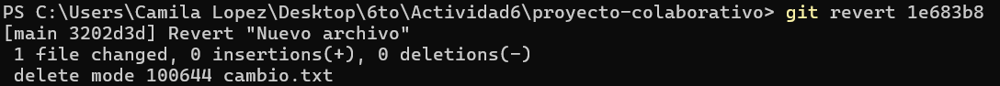
      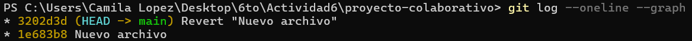

   - **Paso 2**: Realiza una prueba con `git reset --mixed` para entender cómo reestructurar el historial de commits sin perder los cambios no commiteados.
    
   
   

6. **Versionado semántico y etiquetado**

   - **Paso 1**: Aplica versionado semántico al proyecto utilizando tags para marcar versiones importantes.
    

7. **Aplicación de git bisect para depuración**

   - **Paso 1**: Usa `git bisect` para identificar el commit que introdujo un error en el código.
    


#### **Preguntas**

1. **Ejercicio para git checkout --ours y git checkout --theirs**

   El comando `git checkout --ours` se usa para conservar los cambios de la rama actual. Si el equipo A quiere mantener sus cambios, me colocaría en su rama y usaría `git checkout --ours`, reemplazando el archivo en conflicto con la versión de la rama de A y descartando los cambios de B. Por otro lado, si quiero conservar los cambios de la rama con la que estoy fusionando, uso `git checkout --theirs`. Si el equipo B quiere mantener sus cambios, me colocaría en la rama de A y usaría `git checkout --theirs <archivo_en_conflicto>`, reemplazando el archivo con la versión de B y descartando los cambios de A.

2. **Ejercicio para git diff**

   El comando `git diff` permite comparar dos ramas y visualizar las diferencias entre ellas. Muestra los cambios línea por línea, incluyendo archivos modificados, agregados o eliminados.
```
   git diff feature-branch..main
```

   Utilizando `git diff` antes de realizar un merge, se puede verificar que los cambios en `feature-branch` sean correctos y no introduzcan errores en la rama principal (`main`), esto ayuda a identificar posibles conflictos y asegura que solo se integren cambios relevantes, lo que mantiene la estabilidad del proyecto en un entorno ágil con CI/CD.


3. **Ejercicio para git merge --no-commit --no-ff**

   Este comando realiza la fusión pero no genera automáticamente el commit de merge, lo que permite revisar el estado del código o hacer modificaciones antes de confirmarlo. Si hay conflictos, se pueden resolver y comprobar que todo sigue funcionando.
```
   git merge --no-commit --no-ff main
```

Automatización en una pipeline CI/CD
```
 name: Simulate merge with main (no commit)
        run: |
          git merge origin/main --no-commit --no-ff || true
```

4. **Ejercicio para git mergetool**

   El siguiente comando configura VS Code como la herramienta para resolver conflictos y además le indica a Git que espere a que se cierre el editor antes de continuar con el merge:
```
   git config --global merge.tool vscode
   git config --global mergetool.vscode.cmd "code --wait $MERGED"
```

Se usa el siguiente comando para la resolución de conflictos
```
git mergetool
```
   El uso de `git mergetool` en un entorno ágil con CI/CD facilita la resolución visual de conflictos, lo que mejora la colaboración. Para asegurar consistencia entre los miembros del equipo se debe estandarizar la herramienta utilizada (como VS Code).

5. **Ejercicio para git reset**
   `git reset`
   - `--soft`: Revierte el commit, pero mantiene los cambios en el staging area. Ideal si solo se  quiere rehacer el commit.
   - `--mixed`: Revierte el commit y saca los cambios del staging, pero los deja en el directorio de trabajo. Útil si se quiere modificar algo antes de volver a hacer commit.
   - `--hard`: Revierte todo, incluyendo los cambios en el directorio de trabajo. Se pierden los cambios no guardados.
  
   Usaría `git reset --mixed` cuando un commit rompe el pipeline y necesito editar los archivos antes de volver a confirmar, así corrijo el error sin perder el trabajo.

6. **Ejercicio para git revert**

   `git revert` no borra commits, sino que crea uno nuevo que revierte los cambios de un commit anterior. Esto mantiene el historial limpio y permite deshacer errores sin reescribir la historia. Al revertir commits que introdujeron un bug, se recupera la última versión estable del sistema, y como el historial permanece intacto, no hay conflictos con otros desarrolladores ni con ramas derivadas. 

   El siguiente comando revierte los cambios desde el penúltimo (`HEAD~2`) hasta el último commit (`HEAD`), generando un nuevo commit por cada uno revertido.
```
   git revert HEAD~2..HEAD
```

7. **Ejercicio para git stash**
   
   El siguiente comando guarda los cambios actuales antes de cambiar de rama
```
git stash push -m "Avance en feature X"
```
El siguiente comando se usa para restaurar los cambios guardados:
```
git stash pop
```

Scripts que ejecuta cambios temporales y guarda el proceso de una rama con `git stash`
```
#!/bin/bash
# stash cambios locales antes de testear una rama limpia
git stash push -m "backup antes de test"
git checkout main
git pull
pytest
git checkout featureX
git stash pop
```
`git stash` evita que se pierda trabajo al cambiar de rama además previene errores por mezclar cambios incompletos con ramas críticas

8. **Ejercicio para .gitignore**

   Es importante evitar subir archivos irrelevantes que podrían generar errores en producción y evita bugs causados por configuraciones locales. Además un `.gitignore` bien configurado mejora directamente la limpieza del código ya que  mantiene el repositorio libre de archivos innecesarios
   
```
# Configuración y entornos virtuales
.env
*.env
venv/
.envrc

# Logs y archivos temporales
*.log
*.tmp

# IDEs y editores
.vscode/
.idea/
*.swp
*.swo

# Pruebas
coverage/
htmlcov/
*.coverage
.pytest_cache/

# Compilados y bytecode
__pycache__/
*.pyc
*.pyo

```
