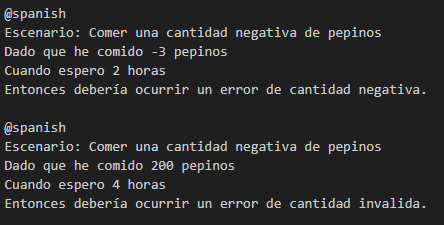

### Actividad: Pruebas BDD con behave en español

#### Instalación
Clona el repositorio y crea un entorno virtual llamado `act9`, luego actívalo.
  

Instala las dependencias necesarias:

#### Ejercicio 1: **Añadir soporte para minutos y segundos en tiempos de espera**
 
1. **Modifica** la función que maneja el tiempo de espera en `steps.py` 

2. **Implementa** un escenario de prueba en Gherkin (`belly.feature`) agregue y pasaron

3. **Considera** también crear pruebas unitarias con Pytest para la lógica de parsing (función que convierte el texto de tiempo en horas decimales).

4. **En un entorno DevOps**:
   - Agrega la ejecución de `behave` y `pytest` en tu *pipeline* de CI/CD, de modo que al hacer push de los cambios se ejecuten automáticamente las pruebas.
   

#### Ejercicio 2: **Manejo de cantidades fraccionarias de pepinos**

1. **Modifica** el sistema (la clase `Belly` y los steps en Behave) para que acepte entradas como `"0.5"`, `"2.75"`.

2. **Implementa** un nuevo escenario en Gherkin donde se ingiera una cantidad fraccionaria y verifica el comportamiento.

3. **Valida** que el sistema lance una excepción o error si se ingresa una cantidad negativa de pepinos.

4. **Pruebas unitarias**:  
   - Cubre el caso de pepinos fraccionarios en `test_belly.py`.
   - Cubre también el caso de pepinos negativos (se espera un error).

#### Ejercicio 3: **Soporte para idiomas múltiples (Español e Inglés)**

1. **Modifica** el parsing de tiempo para que reconozca palabras clave en inglés, además de español (por ejemplo, `"two hours"`, `"thirty minutes"`).

2. **Escribe** al menos dos escenarios de prueba en Gherkin que usen tiempos en inglés.

3. **En un pipeline DevOps**, podrías:
   - Dividir los escenarios en distintos *tags* (`@spanish`, `@english`) y ejecutar cada conjunto en etapas diferentes, o en paralelo.
   
	

#### Ejercicio 4: **Manejo de tiempos aleatorios**

1. **Crea** una función que, dada una expresión como "entre 1 y 3 horas", devuelva un valor aleatorio entre 1 y 3 horas.

2. **Implementa** un escenario en Gherkin que verifique que, tras comer pepinos y esperar un tiempo aleatorio, el estómago puede gruñir.
	
3. **Imprime** (en consola o logs) el tiempo aleatorio elegido para que el resultado sea rastreable en tu pipeline.
	
	

4. **En un pipeline DevOps**:  
   - Considera utilizar un *seed* de aleatoriedad fijo para evitar *flakiness* (tests intermitentes).  
   

#### Ejercicio 5: **Validación de cantidades no válidas**

1. **Añade** validaciones para evitar que el usuario ingrese < 0 pepinos o > 100 pepinos. y **modifica** la lógica para arrojar un error (excepción) si la cantidad no es válida.

2. **Implementa** un escenario de prueba que verifique el comportamiento de error.
	
3. **En tu pipeline**, verifica que la excepción se maneje y el test falle de manera controlada si el sistema no lanza la excepción esperada.
	![[Pasted image 20250422161728.png]]

#### Ejercicio 6: **Escalabilidad con grandes cantidades de pepinos**

1. **Implementa** un escenario en Gherkin para comer 1000 pepinos y esperar 10 horas.
	

#### Ejercicio 7: **Descripciones de tiempo complejas**

1. **En un pipeline**:  
   - Puedes analizar la cobertura de pruebas (coverage) para asegurarte de que la nueva lógica de parsing está completamente testeada.

#### Ejercicio 8: **De TDD a BDD – Convertir requisitos técnicos a pruebas en Gherkin**

1. **Escribe** un test unitario básico con Pytest que valide que si se han comido más de 10 pepinos y se espera 2 horas, el estómago gruñe.

2. **Convierte** ese test unitario en un escenario Gherkin, con la misma lógica, pero más orientado al usuario.

3. **En un pipeline DevOps**:
   - Ejecuta primero los tests unitarios (rápidos) y luego los tests de Behave (que pueden ser más lentos y de nivel de integración).

