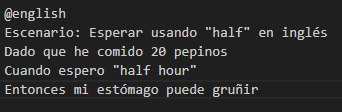

### Actividad: Pruebas BDD con behave en español

#### Instalación

Primero, cloné el repositorio en mi máquina local. Luego, procedí a crear un entorno virtual con el nombre `act9` y luego lo active.
  

También, instale las dependencias necesarias:

#### Ejercicio 1: **Añadir soporte para minutos y segundos en tiempos de espera**
 
Modifiqué la función para interpretar descripciones de tiempo como "media hora" o "2 horas 30 minutos", utilizando expresiones regulares y convirtiendo palabras a números. Si la descripción no es válida, lanza un error.

He implementado y ejecutado escenarios de prueba en Gherkin dentro del archivo `belly.feature`. Probé descripciones de tiempo de espera tanto en segundos como en formatos más complejos, todos los escenarios pasaron correctamente.

He creado pruebas unitarias con Pytest para la función de parsing, que convierte el texto de tiempo en horas decimales.

Utilicé la marca `@pytest.mark.parametrize` para probar varios casos. Las pruebas verifican que el resultado de la función se ajuste a los valores esperados, considerando posibles variaciones en el formato de entrada, como minutos y segundos.

He ejecutado las pruebas unitarias con Pytest y todas han pasado correctamente.

He agregado la ejecución de las pruebas con `pytest` y `behave` en la pipeline de CI/CD utilizando un archivo `tests.yml`. Este archivo se encuentra en el directorio `.github/workflows` y está configurado para ejecutar las pruebas automáticamente al hacer un push en la rama principal (`main`).
   
   

El workflow de CI/CD se ha ejecutado correctamente tras realizar un push en la rama `main`. El pipeline configurado en el archivo `tests.yml` ejecutó las pruebas de forma exitosa.

#### Ejercicio 2: **Manejo de cantidades fraccionarias de pepinos**

He modificado la clase `Belly` y los steps en Behave, para que acepte entradas como "0.5" o "2.75" al registrar la cantidad de pepinos que se han comido.

Convierto la entrada a un número flotante usando `float()` y, si falla, lanzo un `ValueError`.

He implementado un nuevo escenario en Gherkin para verificar el comportamiento cuando se ingiere una cantidad fraccionaria de pepinos.

He validado que el sistema lance una excepción si se ingresa una cantidad negativa de pepinos.

Agregué una validación para asegurarse de que no se pueda ingresar una cantidad negativa de pepinos. Si se intenta, se lanza un `ValueError` con un mensaje adecuado.

En este escenario, intenté ingresar una cantidad negativa de pepinos (-3), lo que generó correctamente una excepción con el mensaje "No se puede comer una cantidad negativa de pepinos".

Esto fue confirmado por el error mostrado en el traceback, donde el `ValueError` fue lanzado como se esperaba

Usé `pytest.mark.parametrize` para probar varios casos, incluidos valores negativos como "-1" y "-0.5", y aseguré que lanzaran un `ValueError` con el mensaje esperado "No se puede comer una cantidad negativa de pepinos". Además, también probé casos con pepinos fraccionarios como "2.5", "0.5", y "3.0", y verifiqué que los resultados se ajusten correctamente a los valores esperados.

He ejecutado las pruebas unitarias con `pytest` y todas las pruebas pasaron correctamente.

#### Ejercicio 3: **Soporte para idiomas múltiples (Español e Inglés)**

He modificado el parsing de tiempo para que reconozca tanto palabras clave en español como en inglés. Añadí soporte para frases como "two hours", "thirty minutes" en inglés. También reemplazé el "and" en las descripciones en inglés por un espacio en blanco y manejé el caso especial de "half hour" para que se interprete correctamente.

He escrito dos escenarios de prueba en Gherkin que utilizan tiempos en inglés, como se solicitó.

He dividido los escenarios en dos grupos con los tags `@spanish` y `@english`, lo que permite ejecutarlos en etapas diferentes en un pipeline de DevOps.

Los escenarios con el tag `@spanish` verifican el comportamiento con descripciones de tiempo en español

Mientras que los de `@english` verifican las descripciones en inglés.

#### Ejercicio 4: **Manejo de tiempos aleatorios**

He creado una función que, al recibir una descripción como "entre 1 y 3 horas", extrae los límites inferior y superior de la descripción de tiempo y devuelve un número aleatorio dentro de ese rango usando `random.uniform()`.

He implementado un escenario en Gherkin para verificar que, después de comer pepinos y esperar un tiempo aleatorio (entre 2 y 4 horas), el estómago pueda gruñir.

He modificado el código para que, además de generar el tiempo aleatorio, también lo imprima en la consola

En este escenario, se generó un tiempo aleatorio de 1.34 horas pero la prueba falló porque se esperaba que el estómago gruñera después de esperar entre 1 y 2 horas. Sin embargo, el tiempo generado fue más cercano a 1 hora, lo que no cumplió con la condición de que el estómago debería gruñir después de ese tiempo.

He utilizado un `seed` fijo (`random.seed(20)`) para asegurar resultados consistentes en las pruebas y evitar problemas de "flakiness" en el pipeline de DevOps.

#### Ejercicio 5: **Validación de cantidades no válidas**

He añadido validaciones para asegurar que la cantidad de pepinos ingresada esté entre 0 y 100. Si el usuario ingresa una cantidad negativa o mayor a 100, se lanza un `ValueError` . Además, la función también maneja el caso donde no se puede convertir la entrada a un número flotante, lanzando un error en caso de que el formato de la cantidad sea inválido.

He implementado dos escenarios en Gherkin para verificar que el sistema lance errores cuando se ingresa una cantidad negativa de pepinos o una cantidad mayor a 100. 

	

He añadido steps para verificar que las excepciones se manejen correctamente. Si no se lanza la excepción esperada, el test falla, asegurando un manejo adecuado de errores en el sistema.

#### Ejercicio 6: **Escalabilidad con grandes cantidades de pepinos**

He implementado un escenario en Gherkin para verificar el comportamiento del sistema al comer una gran cantidad de pepinos (1000) y esperar 10 horas.

#### Ejercicio 7: **Descripciones de tiempo complejas**

He analizado la cobertura de pruebas utilizando la herramienta `coverage` en el pipeline. Esto me permitió asegurarme de que la lógica del parsing esté completamente testeada. El análisis mostró que, aunque se cubrió una gran parte del código, algunas áreas no estaban completamente probadas. Por ejemplo, el archivo `src/belly.py` tiene una cobertura del 0%, lo que indica que no se han ejecutado pruebas sobre ese código. La cobertura total fue del 58%, por lo que es recomendable mejorar la cobertura para asegurar que toda la lógica esté adecuadamente validada.

#### Ejercicio 8: **De TDD a BDD – Convertir requisitos técnicos a pruebas en Gherkin**

He creado un test con `pytest` que valida que, si se comen más de 10 pepinos y se espera 2 horas, el estómago gruñe, verificando que el método `esta_gruñendo()` devuelva `True`.

He convertido el test unitario en un escenario Gherkin, donde tras comer 15 pepinos y esperar 2 horas, el estómago debería gruñir, de manera más orientada al usuario.

En el pipeline de DevOps, ejecuto primero los tests unitarios con `pytest`, que son rápidos, y luego los tests de Behave, que son más lentos y de nivel de integración, separados por los tags `@spanish` y `@english`.

#### Ejercicio 9: **Identificación de criterios de aceptación para historias de usuario**

He identificado los criterios de aceptación de la historia de usuario y los reflejé en dos escenarios Gherkin. El primero verifica que comer suficientes pepinos y esperar el tiempo adecuado hace que el estómago gruñe, mientras que el segundo valida lo contrario.

He implementado los pasos en Behave para gestionar los escenarios, validando la cantidad de pepinos, procesando el tiempo esperado y verificando si el estómago gruñe o no, utilizando aserciones para comprobar el comportamiento esperado.

#### Ejercicio 10: **Escribir pruebas unitarias antes de escenarios BDD**

He escrito un test unitario para la función `pepinos_ingestados()`, que retorna el total de pepinos ingeridos. 

El test asegura que después de comer 15 pepinos, el valor retornado sea 15, siguiendo la secuencia TDD antes de implementar los escenarios en BDD.

He creado un escenario en Gherkin donde, tras comer 15 pepinos, el usuario consulta y ve que ha comido 15 pepinos.

He implementado los pasos en Behave para verificar que, al consultar la cantidad de pepinos ingeridos, el resultado coincida con el valor esperado.

El escenario en Gherkin se ejecutó correctamente.

#### Ejercicio 11: **Refactorización guiada por TDD y BDD**

He refactorizado el código existente siguiendo la metodología TDD y BDD. Primero, elegí la funcionalidad `esta_gruñendo()` y luego aseguré que existan pruebas unitarias parametrizadas para cubrir casos clave. Utilicé `pytest.mark.parametrize` para probar diferentes combinaciones de pepinos, horas y si el estómago debería gruñir o no.

He refactorizado el código para mejorar la eficiencia y reducir la duplicación. Ahora, en lugar de repetir la misma lógica en el método `esta_gruñendo()`, he creado un método auxiliar llamado `gruñir_condiciones()` que devuelve la condición para que el estómago gruña.

He validado que todas las pruebas unitarias y los escenarios BDD siguen pasando correctamente sin cambios.

He activado la medición de cobertura en el pipeline utilizando `pytest` con las opciones `--cov` para indicar la carpeta de código fuente y `--cov-report` para generar un reporte en formato terminal y HTML.

#### Ejercicio 12: **Ciclo completo de TDD a BDD – Añadir nueva funcionalidad**

He desarrollado una nueva funcionalidad desde cero utilizando TDD y BDD. En este caso, la funcionalidad predice si el estómago gruñirá dado un número de pepinos y un tiempo de espera.

He convertido el test en una historia de usuario y escrito el escenario BDD correspondiente.

"**Como** usuario que ha comido una cierta cantidad de pepinos,  
**quiero** saber si mi estómago va a gruñir después de esperar un tiempo determinado,  
**para** poder anticiparme y tomar una acción ."

He implementado la nueva funcionalidad y verificado que tanto la prueba unitaria como el escenario Gherkin pasen correctamente.

![[Pasted image 20250507004426.png]]

#### Ejercicio 13: **Añadir criterios de aceptación claros**

He definido una nueva historia de usuario 

"**Como** usuario,  
**quiero** saber cuántos pepinos más puedo comer antes de que mi estómago gruña,  
**para** poder evitar molestias."

Identifique 3 criterios de aceptación
- Si he comido menos de 10 pepinos, el sistema me dirá cuántos más puedo comer antes de que gruñiría.
- Si ya he comido más de 10 pepinos, el sistema dirá que no puedo comer más.
- El sistema debe considerar que necesito al menos 1.5 horas de espera para que el estómago gruña.

Convertí esos criterios en escenarios BDD.

 Luego, implemente los steps correspondientes

**En un pipeline**, agrupé los escenarios bajo un mismo *tag* (`@criterio_nuevo`) para ejecutarlos juntos.

#### Ejercicio 14: **Integración con Mocking, Stubs y Fakes (para DevOps)**

**Cree** un archivo `clock.py` con una función `get_current_time()`.

**Modifiqué** `Belly` para aceptar un `clock_service` opcional que se inyecta.

Cree un test unitario con Pytest que use `unittest.mock` para simular el paso del tiempo.

 
**En Behave**, usé `environment.py` para inyectar un mock o stub del reloj en el `before_scenario`.

Todos los escenarios y pasos en los tests se ejecutaron correctamente. La salida muestra que 20 escenarios pasaron sin errores, con 60 pasos completados exitosamente.

---

