### Actividad: El patrón Arrange-Act-Assert

#####  Configuración de dependencias y ejecución

En el archivo `requirements.txt` asegúrate de incluir las dependencias necesarias:

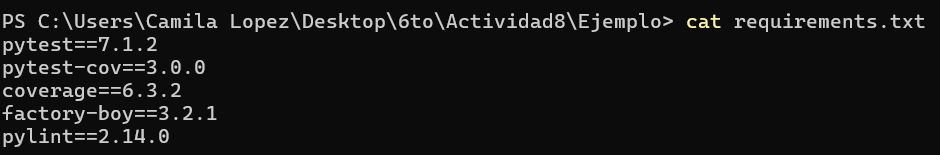


Para ejecutar las pruebas y generar el reporte de cobertura, puedes usar:

```bash
pytest --cov=src --cov-report=term-missing
```
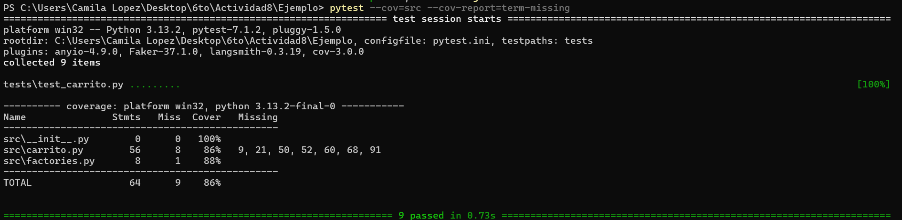

O bien, para generar un reporte HTML:

```bash
pytest --cov=src --cov-report=html
```
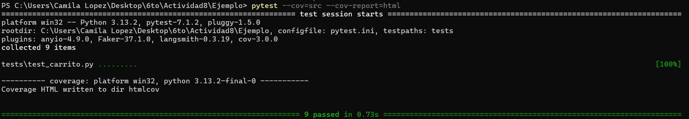
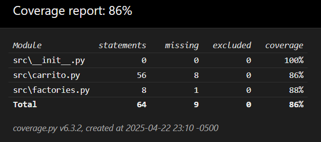

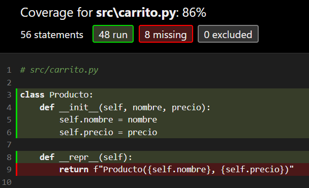

Y para el análisis estático con pylint:

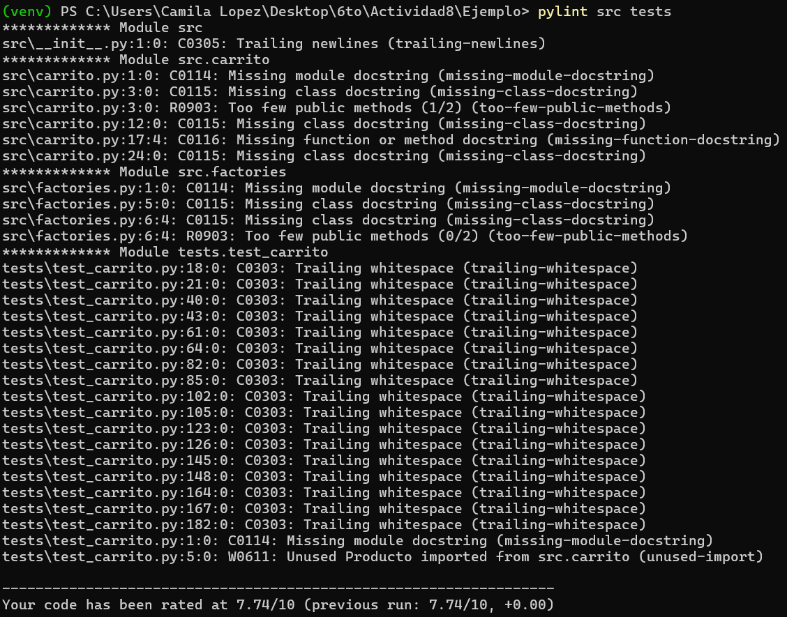


---
#### Ejercicios

##### Ejercicio 1: Método para vaciar el carrito

- Agrega el método `vaciar` en `src/carrito.py` que realice `self.items = []`.
![[Pasted image 20250422235140.png]]
- Crea pruebas en `tests/test_carrito.py` que agreguen varios productos, invoquen `vaciar()` y verifiquen que `obtener_items()` retorne una lista vacía y `calcular_total()` retorne 0.
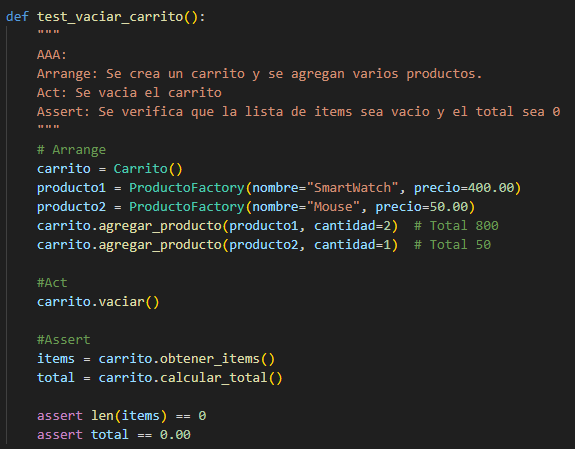

##### Ejercicio 2: Descuento por compra mínima

- Agrega un nuevo método, por ejemplo, `aplicar_descuento_condicional(porcentaje, minimo)` en la clase `Carrito` que primero verifique si `calcular_total() >= minimo`.  
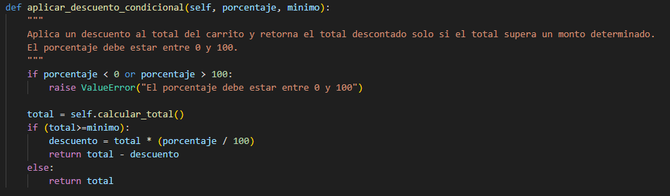

- Si se cumple la condición, aplica el descuento; de lo contrario, retorna el total sin descuento.
- Escribe pruebas para ambos escenarios (condición cumplida y no cumplida).
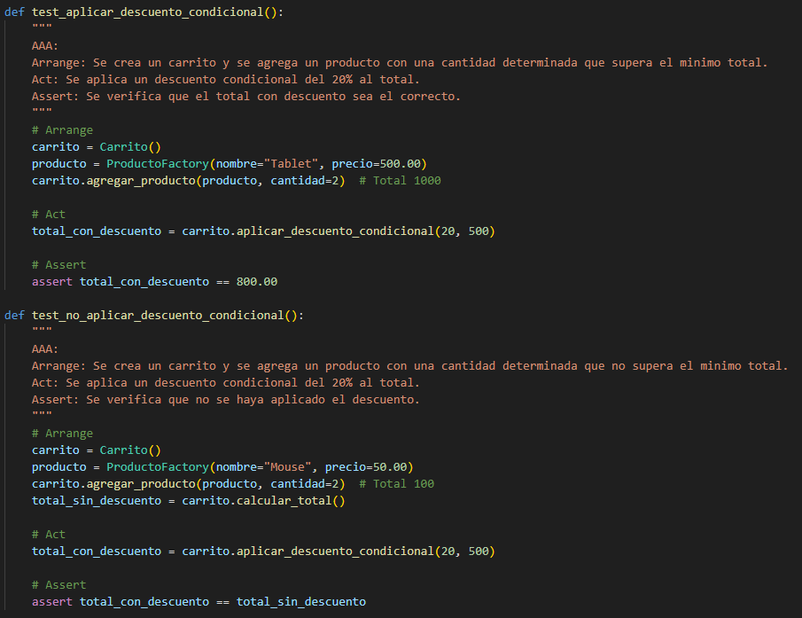


##### Ejercicio 3: Manejo de stock en producto

- Modifica `Producto` en `src/carrito.py` añadiendo `self.stock = stock` en el constructor y actualiza la fábrica en `src/factories.py` para que genere un stock (por ejemplo, entre 1 y 100).
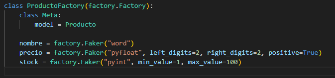
- En `Carrito.agregar_producto`, antes de agregar o incrementar la cantidad, verifica que la suma de cantidades en el carrito no supere el `stock` del producto.
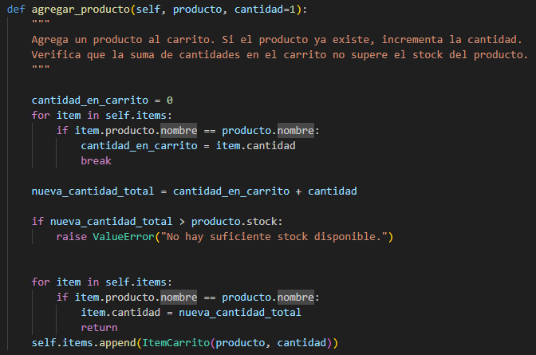

- Escribe pruebas que verifiquen:
  - Se puede agregar un producto dentro del límite de stock.
  - Se lanza una excepción al intentar agregar más unidades de las disponibles.

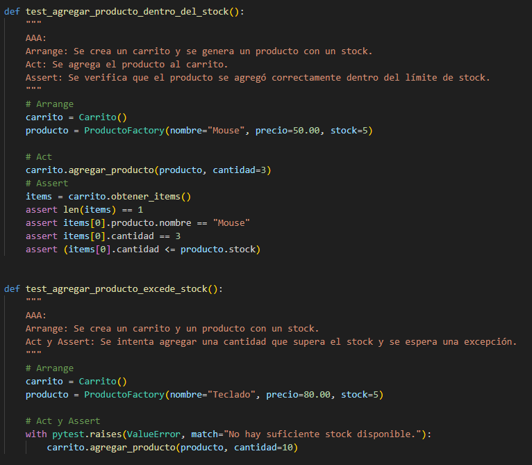

##### Ejercicio 4: Ordenar items del carrito

- Crea un método `obtener_items_ordenados(criterio: str)` donde `criterio` pueda ser `"precio"` o `"nombre"`.
- Utiliza la función `sorted()` con una función lambda para ordenar según el criterio.
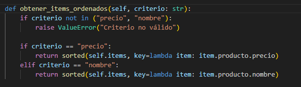


