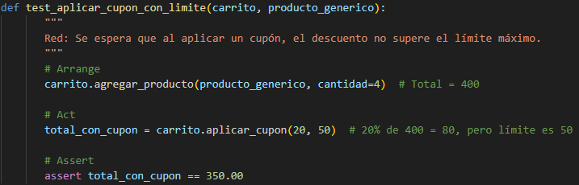
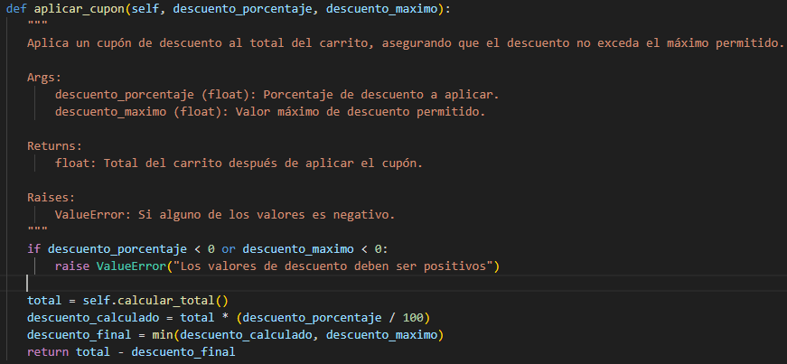

### Actividad 8: El patrón Arrange-Act-Assert

#### Ejemplo
En el presente ejemplo se desarrolla un sistema de carrito de compras, donde se aplican pruebas automatizadas siguiendo el patrón AAA (Arrange, Act, Assert).

Este ejemplo adopta la siguiente estructura de carpetas y archivos:

- **src/**: Contiene el código fuente principal. Incluye `carrito.py` con la lógica del carrito de compras y `factories.py` para generar objetos de prueba reutilizables.
- **tests/**: Almacena las pruebas unitarias en `test_carrito.py`, estructuradas con el patrón AAA
- **pytest.ini**: Configura opciones globales para Pytest.
- **requirements.txt**: Especifica las dependencias necesarias para el proyecto.
- **venv/**: Aloja el entorno virtual para aislar las librerías necesarias.
######  Configuración de dependencias y ejecución

En el archivo `requirements.txt` se incluyen las dependencias necesarias para ejecutar las pruebas y medir la cobertura.

Para ejecutar las pruebas y generar el reporte de cobertura, utilicé el comando `pytest --cov=src --cov-report=term-missing`.

Se observa que todas las pruebas pasaron y que se alcanzó un 86 % de cobertura en `carrito.py`, indicando las líneas del código que no fueron ejecutadas durante las pruebas.

Para generar un reporte visual de cobertura de código en formato HTML, utilicé el comando `pytest --cov=src --cov-report=html`

Se observa que se genera una carpeta llamada `htmlcov/`, la cual contiene un archivo `index.html`

El reporte HTML se abrió en un navegador, permitiendo visualizar gráficamente las líneas del código que fueron ejecutadas durante las pruebas.

El proyecto alcanza una cobertura total del 86 %. El módulo `src/__init__.py` tiene una cobertura completa (100 %), mientras que `src/carrito.py` y `src/factories.py` presentan coberturas parciales de 86 % y 88 %, respectivamente.

El archivo `src/factories.py` contiene 8 líneas de código, de las cuales 7 fueron ejecutadas y 1 quedó sin cubrir.

El archivo `src/carrito.py` contiene 56 líneas de código, de las cuales se ejecutaron 48 y 8 no fueron cubiertas.

Para ejecutar el análisis estático con pylint, es decir, examinar el código fuente sin necesidad de ejecutarlo, utilicé el comando `pylint src tests`.

El análisis estático identifica principalmente la ausencia de docstrings en módulos, clases y métodos, así como espacios en blanco innecesarios al final de algunas líneas en `test_carrito.py`. También resalta una importación no utilizada. El código obtuvo una calificación general de 7.74/10.

---
#### Ejercicios

##### Ejercicio 1: Método para vaciar el carrito

Se implementó el método `vaciar()` en `carrito.py`, el cual reinicia la lista `self.items` para eliminar todos los productos del carrito.

Se definió una prueba en `tests/test_carrito.py` que verifica que al vaciar el carrito, la lista de productos quede vacía y el total calculado sea cero.

##### Ejercicio 2: Descuento por compra mínima

Se implementó en `src/carrito.py` el método `aplicar_descuento_condicional`, que aplica un descuento al total si este supera un monto mínimo definido, validando también que el porcentaje sea válido.

Se definieron dos pruebas en `tests/test_carrito.py` que verifican el comportamiento del descuento condicional: una para el caso en que sí se aplica y otra para cuando no se cumple el mínimo.

##### Ejercicio 3: Manejo de stock en producto

Se implementó el atributo `stock` dentro del modelo `Producto` en `src/carrito.py` y se actualizó la fábrica `ProductoFactory` para generar automáticamente un valor entre 1 y 100 al crear objetos de prueba.

Se modificó el método `agregar_producto` para verificar que la cantidad total del producto en el carrito no exceda su stock, lanzando una excepción en caso de sobrepasarlo.

Se implementó la prueba `test_agregar_producto_dentro_del_stock` para validar que un producto puede agregarse correctamente al carrito sin superar su límite de stock, comprobando cantidad y nombre.

Luego, se implementó la prueba `test_agregar_producto_excede_stock` que verifica que al intentar añadir más unidades de las disponibles, se lanza correctamente una excepción `ValueError` con el mensaje esperado.

##### Ejercicio 4: Ordenar items del carrito

Se implementó el método `obtener_items_ordenados` que permite ordenar los productos del carrito por precio o por nombre, utilizando `sorted()` con funciones lambda y validando el criterio ingresado.

Se implementó la prueba `test_obtener_items_precio` para verificar que los productos en el carrito se ordenan correctamente en orden ascendente por precio.

También se implementó la prueba `test_obtener_items_nombre`, que valida que los productos se ordenan alfabéticamente por nombre, incluso si fueron agregados en orden inverso.

##### Ejercicio 5: Uso de Pytest Fixtures

Se definieron las fixtures `carrito` y `producto_generico` en `tests/conftest.py` para reutilizar objetos comunes en múltiples pruebas, facilitando la creación de carritos vacíos y productos predefinidos sin repetir código.

Se actualizaron las 16 pruebas para utilizar las fixtures definidas en `conftest.py`, reemplazando la creación manual de objetos.

Se observa, por ejemplo, que las pruebas `test_agregar_producto_nuevo` y `test_agregar_producto_existente_incrementa_cantidad` ahora aprovechan las fixtures `carrito` y `producto_generico` como dependencias inyectadas automáticamente.

Se ejecutaron las pruebas actualizadas con `pytest` y las 16 se completaron exitosamente, confirmando que la incorporación de fixtures no afectó el comportamiento esperado del sistema y que todas las funcionalidades continúan operando correctamente.

##### Ejercicio 6: Pruebas parametrizadas

Se parametrizó la prueba `test_aplicar_descuento` para verificar distintos porcentajes de descuento y sus respectivos totales esperados, haciendo uso de `@pytest.mark.parametrize`

Se parametrizó la prueba `test_actualizar_cantidad_producto` para verificar tanto casos válidos como inválidos al actualizar la cantidad de un producto, validando que se actualice correctamente o se lance una excepción según corresponda.

Nuevamente se ejecutaron las pruebas y todas pasaron exitosamente, confirmando que las  parametrizaciones no introdujeron fallos en el sistema.

##### Ejercicio 7: Calcular impuestos en el carrito

##### Red
Se definió una prueba llamada `test_calcular_impuestos` que espera que el método `calcular_impuestos` retorne correctamente el 10 % del total del carrito. 

   

  Sin embargo, como dicho método aún no existe, se produce un error al ejecutar la prueba
	

##### Green
se implementó el método `calcular_impuestos` con la lógica mínima necesaria para pasar la prueba, devolviendo el valor del impuesto según el total del carrito y el porcentaje indicado.

Luego de implementar el método `calcular_impuestos`, se ejecutaron nuevamente las pruebas y las 22 pasaron exitosamente, confirmando que la funcionalidad fue incorporada correctamente.

##### Refactor 
Se refactorizó el método añadiendo validaciones para asegurar que el porcentaje esté entre 0 y 100

##### Ejercicio 8: Aplicar cupón de descuento con límite máximo

Se implementó la prueba `test_aplicar_cupon_con_limite`, que verifica que al aplicar un cupón del 20 % sobre un total de $400, el descuento no exceda los $50 permitidos, esperando un total final de $350.

Sin embargo, como el método `aplicar_cupon` aún no existe, se produce un error al ejecutar la prueba

##### Green
Se implementó el método `aplicar_cupon` con la lógica básica para aplicar el descuento limitado.

   

Luego de implementar el método `aplicar_cupon`, se ejecutaron nuevamente las pruebas y las 23 pasaron exitosamente, confirmando que la funcionalidad fue incorporada correctamente.

##### Refactor

Se refactorizó el método añadiendo validaciones para asegurar que los valores sean positivos.
  

##### Ejercicio 9: Validación de stock al agregar productos (RGR)

**Objetivo:**  
Asegurarse de que al agregar un producto al carrito, no se exceda la cantidad disponible en stock.  

##### Red
Se implementó la prueba `test_agregar_producto_excede_stock` para asegurar que, si se intenta agregar una cantidad mayor a la disponible en stock, se lance correctamente una excepción `ValueError`

##### Green
El método `agregar_producto` ya incluía una validación de stock que impide agregar más unidades de las disponibles, por lo que no fue necesario modificarlo para que la prueba pasara.

   

Se ejecutaron nuevamente las pruebas y las 23 pasaron exitosamente, confirmando que la funcionalidad fue incorporada correctamente.

##### Refactor
Se refactorizó el método `agregar_producto` moviendo la lógica de búsqueda a un método privado `_buscar_item`,

   

 