### Actividad 9: Red-Green-Refactor

### Ejemplo 
En este ejemplo se extiende la clase `ShoppingCart` con nuevas funcionalidades, aplicando el ciclo Red–Green–Refactor para guiar el desarrollo paso a paso con pruebas automatizadas.

Este ejemplo adopta la siguiente estructura de carpetas y archivos:

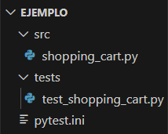

- **src/**: Contiene el código fuente principal. Incluye `shopping_cart.py`, donde se implementa paso a paso la lógica del carrito de compras.
- **tests/**: Almacena las pruebas unitarias en `test_shopping_cart.py`, organizadas siguiendo el enfoque Red–Green–Refactor.
- **pytest.ini**: Define configuraciones comunes para ejecutar las pruebas de forma coherente en todo el proyecto.
#### **Primera iteración (RGR 1): Agregar artículos al carrito**

Se definió la prueba `test_add_item`, la cual utiliza la clase `ShoppingCart` para verificar que los artículos se almacenen correctamente con nombre, cantidad y precio unitario.

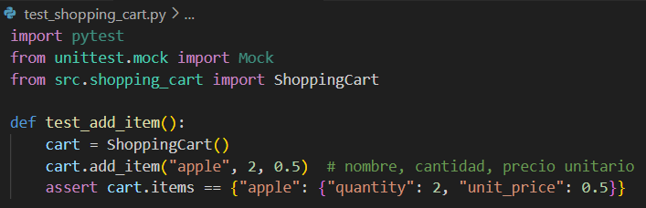

Sin embargo, al no existir aún la clase `ShoppingCart`, se produce un error al ejecutar la prueba
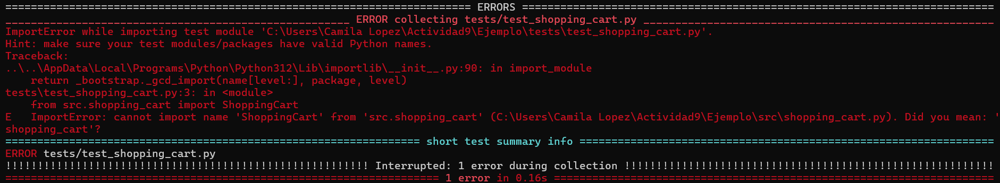

**2. Implementar el código para pasar la prueba (Green)**

Se implementó la clase `ShoppingCart` con la lógica mínima necesaria: un diccionario interno `items` y el método `add_item`, que permite registrar productos con su nombre, cantidad y precio unitario.
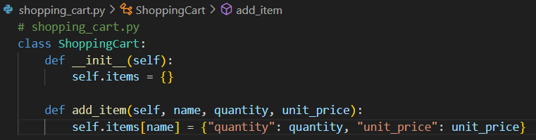

Luego de implementar el método `calcular_impuestos`, se ejecutó la prueba y pasó exitosamente, confirmando que la funcionalidad fue incorporada correctamente.

**3. Refactorizar el código si es necesario (Refactor)**
Se refactorizó el método `add_item` para permitir acumular la cantidad si el artículo ya existe en el carrito, facilitando múltiples adiciones del mismo producto.

#### **Segunda iteración (RGR 2): Eliminar artículos del carrito**

**1. Escribir una prueba que falle (Red)**

Se definió la prueba `test_remove_item` que espera eliminar un artículo del carrito.

Sin embargo, al no existir el método `remove_item` , se produce un error al ejecutar la prueba

**2. Implementar el código para pasar la prueba (Green)**

Se agregó la lógica mínima en el método `remove_item` dentro de `ShoppingCart`, permitiendo eliminar un artículo por su nombre.

Luego de implementar el método `remove_item`, se ejecutó la prueba y pasó exitosamente, confirmando que la funcionalidad fue incorporada correctamente.

#### **Tercera iteración (RGR 3): Calcular el total del carrito**

**1. Escribir una prueba que falle (Red)**

Se definió la prueba `test_calculate_total` para verificar que la clase `ShoppingCart` calcule correctamente el total sumando precio por cantidad de cada artículo.

Sin embargo, al no existir el método `calculate_total` , se produce un error al ejecutar la prueba

**2. Implementar el código para pasar la prueba (Green)**

Se implementó el método `calculate_total` en la clase `ShoppingCart`, sumando el producto de cantidad y precio unitario por cada artículo.

Luego de implementar el método `calculate_total`, se ejecutó la prueba y pasó exitosamente, confirmando que la funcionalidad fue incorporada correctamente.

**3. Refactorizar el código si es necesario (Refactor)**

Se refactorizó el método `calculate_total` usando comprensión de listas y `sum`, logrando una versión más concisa.

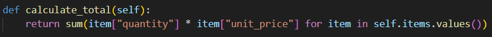

#### **Ejecutar las pruebas**

Se ejecutaron las 3 pruebas correspondientes al desarrollo acumulativo del carrito, y todas pasaron exitosamente.

#### **Más interacciones**

#### **Cuarta iteración (RGR 4): aplicar descuentos al total**

**1. Escribir una prueba que falle (Red)**
Se definió la prueba `test_apply_discount` que simula una compra y aplica un 10 % de descuento con el método `apply_discount`

Sin embargo, al no existir el método `apply_discount`, se produce un error al ejecutar la prueba

**2. Implementar el código para pasar la prueba (Green)**

Se implementó el método `apply_discount` y se modificó `calculate_total` para aplicar el porcentaje de descuento.
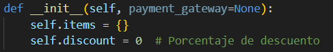

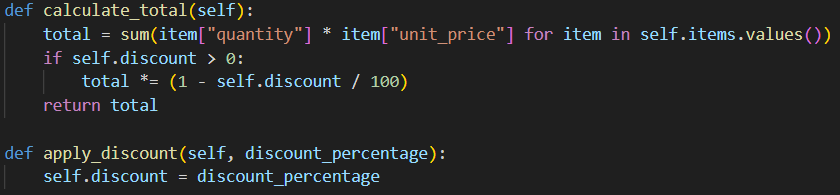

Luego de implementar el método `apply_discount`, se ejecutó la prueba y pasó exitosamente, confirmando que la funcionalidad fue incorporada correctamente.

**3. Refactorizar el código si es necesario (Refactor)**

Se refactorizó el manejo de descuentos validando que el porcentaje esté entre 0 y 100, y se añadió redondeo a dos decimales en `calculate_total` para mayor precisión.

![[Pasted image 20250505012441.png]]

#### **Ejecutar las pruebas**

Se ejecutaron las 4 pruebas correspondientes al desarrollo acumulativo del carrito ejecutando el comando `pytest test_shopping_cart.py` , y todas pasaron exitosamente.

### RGR, mocks, stubs e inyección de dependencias

#### **Quinta iteración (RGR 5): Procesar Pagos a través de un Servicio Externo**

##### **1. Escribir una prueba que falle (Red)**
El test valida que `ShoppingCart` invoque correctamente el método `process_payment` con el total calculado tras aplicar un descuento.

![[Pasted image 20250505013110.png]]

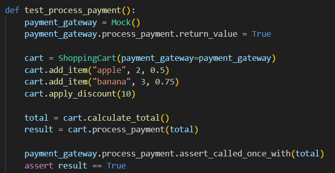

Sin embargo, al no existir el método `process_payment` en la clase `ShoppingCart`, se produce un error al ejecutar la prueba

##### **2. Implementar el código para pasar la prueba (Green)**

Se implementó la lógica mínima del método `process_payment`, permitiendo delegar el cobro al `payment_gateway` mediante inyección de dependencia.

![[Pasted image 20250505013333.png]]

Luego de implementar el método `process_payment`, se ejecutó la prueba y pasó exitosamente, confirmando que la funcionalidad fue incorporada correctamente.

##### **3. Refactorizar el código si es necesario (Refactor)**

Se refactorizó `process_payment` para manejar excepciones del `payment_gateway`, permitiendo capturar fallos y asegurar mayor robustez en el proceso de pago.

Se añadieron dos pruebas: `test_process_payment`, que valida un pago exitoso usando un mock, y `test_process_payment_failure`, que verifica que se lance una excepción al simular un fallo en el proceso de pago.

#### **Ejecutar las Pruebas**

Se ejecutaron las 4 pruebas correspondientes al desarrollo acumulativo del carrito ejecutando el comando `pytest test_shopping_cart.py` , y todas pasaron exitosamente.

---
### Ejercicio

El presente ejercicio desarrolla seis iteraciones TDD sobre la clase `UserManager`, aplicando técnicas como mocks, stubs, fakes, spies e inyección de dependencias, cada una en un escenario distinto.
#### Iteración 1: Agregar usuario (Básico)

#### Paso 1 (Red): Escribimos la primera prueba

El test `test_agregar_usuario_exitoso` verifica que al agregar un usuario mediante `add_user`, este quede registrado correctamente, comprobándolo con `user_exists`.

**Archivo:** `tests/test_user_manager.py`
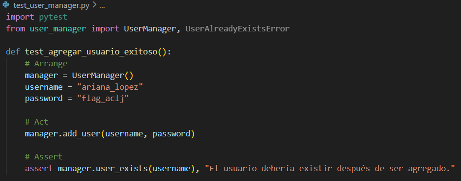

Sin embargo, al no existir la clase `UserManager`, se produce un error al ejecutar la prueba
![[Pasted image 20250505082414.png]]

#### Paso 2 (Green): Implementamos lo mínimo para que pase la prueba

Se implementó la clase `UserManager` con los métodos mínimos `add_user` y `user_exists` para registrar usuarios y validar su existencia.
**Archivo:** `user_manager.py`
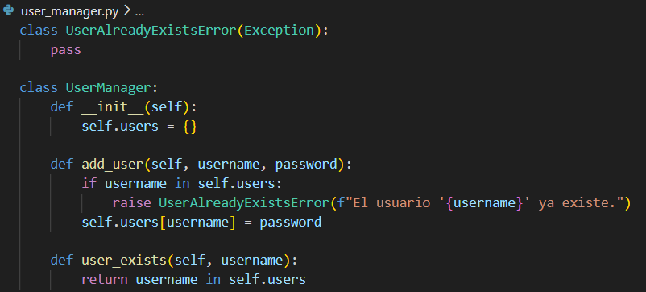

Luego de implementar la clase `UserManager`, se ejecutó la prueba y pasó exitosamente, confirmando que la funcionalidad fue incorporada correctamente.

#### Iteración 2: Autenticación de usuario (Introducción de una dependencia para Hashing)

#### Paso 1 (Red): Escribimos la prueba

La prueba `test_autenticar_usuario_exitoso_con_hash` verifica que `UserManager` pueda autenticar correctamente a un usuario utilizando un servicio de hash simulado (`FakeHashService`) que transforma la contraseña antes de almacenarla y compararla.

**Archivo:** `tests/test_user_manager.py`

Sin embargo, al no existir el método `authenticate_user` ni la inyección de `hash_service`, se produce un error al ejecutar la prueba.

#### Paso 2 (Green): Implementamos la funcionalidad y la DI

Se implementó la inyección del servicio de hash en `UserManager`, permitiendo usar un servicio externo o uno por defecto para almacenar contraseñas de forma segura.

Luego de implementar la inyección del servicio de hash en la clase `UserManager`, se ejecutó la prueba y pasó exitosamente, confirmando que la funcionalidad fue incorporada correctamente.

#### Iteración 3: Uso de un Mock para verificar llamadas (Spy / Mock)

Ahora queremos asegurarnos de que, cada vez que llamamos a `add_user`, se invoque el método `hash` de nuestro servicio de hashing. Para ello, usaremos un **mock** que “espía” si se llamó el método y con qué parámetros. Esto sería un caso de **Spy o Mock**.

#### Paso 1 (Red): Escribimos la prueba de "espionaje"

El test `test_hash_service_es_llamado_al_agregar_usuario` verifica que al agregar un usuario, se invoque el método `hash` del servicio de hash con la contraseña proporcionada, usando un mock para espiar la llamada.

#### Paso 2 (Green): Probar que todo pasa

Realmente, nuestro código ya llama a `hash_service.hash`. Ejecutamos `pytest` y la prueba paso exitosamente, pues la implementación actual ya cumple la expectativa.

#### Iteración 4: Excepción al agregar usuario existente (Stubs/más pruebas negativas)

#### Paso 1 (Red): Prueba

El test `test_no_se_puede_agregar_usuario_existente_stub` verifica que al intentar agregar un usuario ya existente (simulado mediante un stub que siempre devuelve `True` en `user_exists`), se lance correctamente la excepción `UserAlreadyExistsError`.
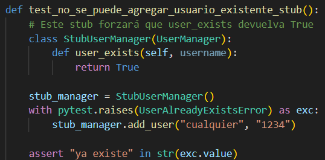

Sin embargo, al no haberse implementado aún la excepción `UserAlreadyExistsError` o la lógica interna del método `add_user` que la lanza cuando el usuario ya existe, se produce un error al ejecutar la prueba.
![[Pasted image 20250505110855.png]]

#### Paso 2 (Green)
Se implementó la excepción `UserAlreadyExistsError` junto con el método `user_exists`, permitiendo que el método `add_user` valide usuarios duplicados.

Luego de implementar  la excepción `UserAlreadyExistsError`, se ejecutó la prueba y pasó exitosamente, confirmando que la funcionalidad fue incorporada correctamente.

#### Iteración 5: Agregar un "Fake" repositorio de datos (Inyección de Dependencias)
#### Paso 1 (Red): Prueba
El test `test_inyectar_repositorio_inmemory` verifica que `UserManager` pueda usar un repositorio de usuarios inyectado (en este caso, uno en memoria) y que, al agregar un usuario, este sea correctamente almacenado y luego reconocido como existente.

Sin embargo, al no haberse implementado aún el soporte para repositorios externos en la clase `UserManager`, se produce un error al ejecutar la prueba.

#### Paso 2 (Green): Implementación

Se modificó la clase `UserManager` para permitir la inyección de un repositorio de usuarios (`repo`). Si no se proporciona uno, se usa un repositorio en memoria por defecto (`InternalRepo`). Esto facilita el uso de diferentes fuentes de almacenamiento (como bases de datos o repositorios fake para pruebas).

Luego de implementar la inyección de un repositorio de usuarios (`repo`), se ejecutó la prueba y pasó exitosamente, confirmando que la funcionalidad fue incorporada correctamente.

#### Iteración 6: Introducir un “Spy” de notificaciones (Envío de correo)

#### Paso 1 (Red): Prueba
El método `test_envio_correo_bienvenida_al_agregar_usuario()` verifica que, al agregar un nuevo usuario mediante `UserManager`, se envíe correctamente un correo de bienvenida. Para lograrlo, se utiliza un objeto `MagicMock` como servicio de correo simulado (`mock_email_service`), que se inyecta en el `UserManager`. 

Luego se agrega un usuario y finalmente se comprueba que el método `send_welcome_email` del servicio simulado fue llamado una vez con el nombre del usuario, asegurando así que la funcionalidad de notificación está integrada correctamente sin enviar correos reales.

Sin embargo, `UserManager` aún no llama a ningún `send_welcome_email`, por lo que se produce un error al ejecutar la prueba.

#### Paso 2 (Green): Implementamos la llamada al servicio de correo

El método `add_user` dentro de la clase `UserManager` se encarga de agregar un nuevo usuario al sistema. Primero verifica si el usuario ya existe; si es así, lanza una excepción `UserAlreadyExistsError`. Si no existe, genera un hash de la contraseña usando el servicio de hashing configurado, guarda el usuario en el repositorio, y finalmente, si hay un servicio de correo (`email_service`) definido, envía un correo de bienvenida llamando al método `send_welcome_email` con el nombre del usuario.

![[Pasted image 20250505164648.png]]

Luego de llamar a `send_welcome_email`, se ejecutó la prueba y pasó exitosamente, confirmando que la funcionalidad fue incorporada correctamente.

---

### Ejercicio integral
En este ejercicio, veremos un ejemplo de 6 iteraciones en la metodología TDD **(Red-Green-Refactor)**.
#### Estructura recomendada
Este ejemplo adopta la siguiente estructura de carpetas y archivos:

#### Iteración 1: Agregar usuario (Básico)

#### Paso 1 (Red): Primera prueba

El método `test_agregar_usuario_exitoso` es una prueba que valida el comportamiento de la clase `UserManager` al agregar un nuevo usuario. En primer lugar, crea una instancia de `UserManager` y define un nombre de usuario y una contraseña. Luego, llama al método `add_user` para agregar al usuario al sistema y, finalmente, utiliza la aserción `user_exists` para verificar si el usuario ha sido agregado correctamente a la base de datos. Si el usuario se encuentra, la prueba pasará exitosamente, confirmando que el usuario fue agregado.
Archivo: `tests/test_user_manager.py`

Al ejecutar `pytest`, esta prueba fallará (Red) porque `UserManager` aún no está implementado (o está incompleto).

#### Paso 2 (Green): Implementamos lo mínimo

El código define la clase `UserManager` con tres métodos esenciales. El método `__init__` inicializa un diccionario vacío `users` para almacenar los usuarios. El método `add_user` agrega un nuevo usuario al diccionario, pero primero verifica si el usuario ya existe, lanzando una excepción `UserAlreadyExistsError` si es el caso. El método `user_exists` comprueba si un nombre de usuario ya está registrado en el diccionario.

Archivo: `user_manager.py`

Re-ejecutamos `pytest` y la prueba debe pasar (Green).

#### Iteración 2: Autenticación con inyección de un servicio de Hashing (Fake)

#### Paso 1 (Red): Nueva prueba
El código define una clase `FakeHashService`, que simula un servicio de hash con un prefijo "Fakehash:" para la prueba. El método `hash` devuelve el texto plano precedido por "Fakehash:", mientras que el método `verify` compara el texto con un hash simplificado. La prueba `test_autenticar_usuario_exitoso_con_hash` verifica que un usuario se autentique correctamente usando este servicio de hash simulado, creando primero un usuario con un hash simulado y luego autenticándolo.

Si ejecutamos ahora, fallará porque `UserManager` no usa aún ningún servicio de hashing ni tiene método `authenticate_user`.

#### Paso 2 (Green): Implementación con inyección de hash_service

En `user_manager.py`, agregamos la dependencia:

Corremos `pytest`: la prueba debe pasar (Green).

#### Iteración 3: Uso de un Mock/Spy para verificar llamadas internas

Queremos asegurarnos de que, al agregar un usuario, efectivamente se llama a `hash`. Usaremos `MagicMock` de `unittest.mock` para espiar la llamada.

#### Paso 1 (Red): Prueba con Spy

Esta prueba fallaría si `add_user` no invocara a `hash(...)`.

#### Paso 2 (Green)

Nuestra implementación ya invoca `hash(...)`, así que al correr `pytest` debería pasar sin cambios.

#### Iteración 4: Uso de Stubs para forzar comportamientos

#### Paso 1 (Red): Prueba
Como ejemplo, usaremos un **stub** que fuerza que `user_exists` devuelva `True`, de modo que `UserAlreadyExistsError` se lance inmediatamente.

Si ejecutamos ahora, fallará porque `add_user` no implementa la lógica que lanza la excepción si existe el usuario

#### Paso 2 (Green)

Ya tenemos en `add_user` la lógica que lanza la excepción si existe el usuario. Nuestra subclase “stub” fuerza esa condición. La prueba debe pasar de inmediato.

#### Iteración 5: Inyección de un repositorio (Fake)

Queremos que `UserManager` no dependa de un diccionario interno para almacenar usuarios, sino que podamos inyectar (en producción) un repositorio real (BD, etc.) y en las pruebas, un repositorio en memoria. Esto es otro ejemplo de **Fake**.

#### Paso 1 (Red): Prueba con un repositorio fake

Falla (Red) porque `UserManager` no recibe ni usa un `repo`.

#### Paso 2 (Green): Implementación

En `user_manager.py`, modificamos el constructor y métodos:

Ejecutamos `pytest`: debe pasar (Green).

---

#### Iteración 6: Spy de Servicio de Correo

Por último, simularemos que cada vez que se registra un nuevo usuario, se envía un correo de bienvenida. Queremos verificar esa llamada con un **Spy** o un **Mock**.

#### Paso 1 (Red): Prueba

Falla (Red) porque no existe la lógica de correo.

#### Paso 2 (Green): Implementamos en `UserManager`

Ejecutamos `pytest` y la prueba debe pasar (Green).

