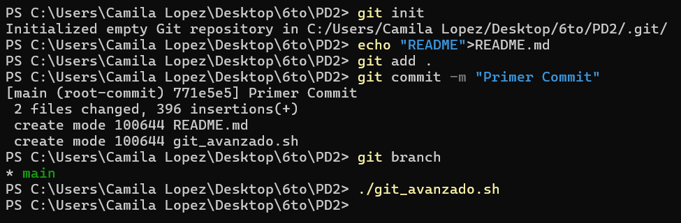
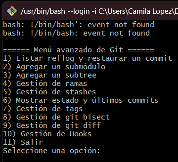
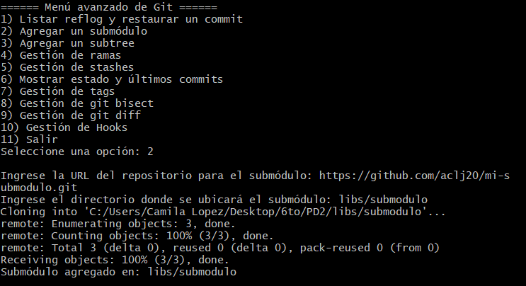
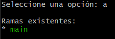
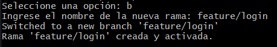
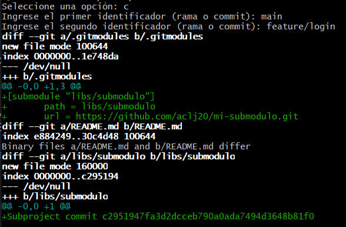
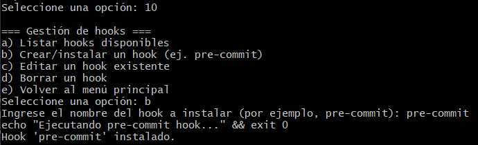

### Actividad: Exploración y administración avanzada de Git mediante un script interactivo

#### Instrucciones previas

- Asegúrate de ejecutar el script dentro de la raíz de un repositorio Git, ya que el script interactúa con el entorno Git.
   

### Procedimiento de la actividad

1. **Inicio del script**

   Tras darle permisos de ejecución y ejecutar el script desde la raíz de un repositorio Git, se muestra el siguiente menú en la terminal:
	   

2. **Opción: agregar un submódulo (Opción 2)**
	   

   - **Ejemplo A: Listar ramas (Opción a)**

	
   - **Ejemplo B: Crear una nueva rama (Opción b)**
	
	

3. **Opción: Gestión de git diff (Opción 9)**
	
	
	
4. **Opción: Gestión de hooks (Opción 10)**
	
	

